#  数学表达式 - （MAE）解析库

- Switch to [English Document](https://github.com/BeardedManZhao/mathematical-expression/blob/main/README.md)

## 🫠 重要通知

> ✅【一般】 **_PS 请尽量使用 1.3.1 版本以及以上的版本，这将有助于您使用更加稳定的版本，修复了 1.2.x
中[所有已知的bug](https://github.com/BeardedManZhao/mathematical-expression/issues)_**

> ⚠️【重要】 [1.3.7](https://github.com/BeardedManZhao/mathematical-expression/tree/b8a6dc7a05b8cf2c4b2de57389d520cd03e78ff0)
> 版本和 [1.4.0](https://github.com/BeardedManZhao/mathematical-expression.git) 版本的内容几乎一致，主要的区别就是包模块的变更，
**请注意，我们将在 1.4.0 版本以及之后的所有版本中
重构包名为 `io.github.beardedManZhao.mathematicalExpression` 这是为了避免在 Java 的诸多依赖中，包名出现冲突的情况~**
>
> 为了避免小伙伴们担心由于包更新导致的兼容性问题，因此我们提供了 1.3.7
> 版本，您可以继续使用旧包名，但是我们强烈建议您使用新版本，因为新版本的包名已经更新为 `io.github.beardedManZhao.mathematicalExpression`
> ，若您对于修改包名称和更新有什么问题或建议，请及时联系我们！！

## 介绍


本框架是一种针对数学公式解析的有效工具，能够解析包含嵌套函数，包含函数，数列步长累加等数学公式，返回值是一个数值的结果对象，同时也可以进行比较运算的操作，再进行比较的时候，返回值是一个布尔值结果对象。

- Maven依赖坐标

  您可以直接使用maven将本框架导入到项目中使用，能够高效的使用该功能

```xml

<dependencies>
    <dependency>
        <groupId>io.github.BeardedManZhao</groupId>
        <artifactId>mathematical-expression</artifactId>
      <version>1.4.4</version>
    </dependency>
</dependencies>
```

您也可以直接通过gradle将“mathematical-expression”载入到您的框架中，使用下面的依赖即可。

```
dependencies {
    implementation 'io.github.BeardedManZhao:mathematical-expression:1.4.4'
}
```

### 历史版本

您可以在 https://github.com/BeardedManZhao/mathematical-expression/tree/main/update 中查询到发布的所有版本的变更详细报告。

## 为什么要选择 mathematical-expression

mathematical-expression 具有简单，快速，易上手，支持的语言种类多 等优势，它具有 C Java python 版本的 API 使用方法几乎一致。

### 易于使用的API

调用库是很简单的，您可以使用如下代码进行计算，当然，如果您不需要进行检查，您还可以将下面的计算代码压缩为 `System.out.println(Mathematical_Expression.getInstance(Mathematical_Expression.bracketsCalculation2).calculation("(1+2)*3"));`
能够有效减少代码量！

```java
import io.github.beardedManZhao.mathematicalExpression.core.Mathematical_Expression;
import io.github.beardedManZhao.mathematicalExpression.core.calculation.Calculation;
import io.github.beardedManZhao.mathematicalExpression.exceptional.WrongFormat;

public class MAIN {

  public static void main(String[] args) throws WrongFormat {
    final Calculation instance = Mathematical_Expression.getInstance(
            // 在这里选择您要使用的不同计算组件即可
            Mathematical_Expression.bracketsCalculation2
    );
    // 如果您确保表达式的无误，可以不检查
    instance.check("(1+2)*3");
    System.out.println(instance.calculation("(1+2)*3"));
  }
}
```

### 超强的功能性，拿捏诸多函数 和 计算符

您不熟悉编程？很简单，您完全可以使用数学表达式进行函数的自定义，同时我们还准备了诸多的内置函数，它们统一在 `function.calculation.io.github.beardedManZhao.mathematicalExpression.core.FunctionPackage`
类中！！

```java
import io.github.beardedManZhao.mathematicalExpression.core.Mathematical_Expression;

import io.github.beardedManZhao.mathematicalExpression.core.calculation.Calculation;
import io.github.beardedManZhao.mathematicalExpression.core.calculation.function.FunctionPackage;
import io.github.beardedManZhao.mathematicalExpression.core.calculation.function.Functions;
import io.github.beardedManZhao.mathematicalExpression.core.container.CalculationResults;
import io.github.beardedManZhao.mathematicalExpression.exceptional.WrongFormat;

// 准备一个数学函数 x 的阶乘 + 1
@Functions("f(x) = x! + 1")
public class MAIN {
  public static void main(String[] args) throws WrongFormat {
    // 您可以将我们内置的函数进行导入，这样就可以使用一些内置函数了，如 sum
    // 注册内置的函数库 - 数学库
    Mathematical_Expression.register_function(FunctionPackage.MATH);
    // 当然 您还可以使用自定义函数的方式 将您自己的函数 注册进去
    Mathematical_Expression.register_function("fTwo(x, y) = x + y");
    // 您也可以使用注解批量的 将 MAIN 注解的所有函数注册 并进行使用
    Mathematical_Expression.register_function(MAIN.class);
    // 在下面就可以开始进行计算了 首先是获取到计算组件
    final Calculation instance = Mathematical_Expression.getInstance(Mathematical_Expression.functionFormulaCalculation2);
    // 然后进行一个简单的检查
    instance.check("1 + sum(1,2,3,4) + f(3) * fTwo(1, 2)");
    // 然后直接进行计算 您的表达式中完全是可以使用函数的哦~~~
    final CalculationResults calculation = instance.calculation("1 + sum(1,2,3,4) + f(3) * fTwo(1, 2)");
    // 直接打印就可以啦~
    System.out.println(calculation);
  }
}
```

计算符号的支持不够多？不用担心，此库支持的运算符种类繁多，您可以在这里看到所有计算符.

| 符号名称   | 符号语法（n代表操作数） | 支持版本  | 符号意义         |
|--------|--------------|-------|--------------|
| 加法运算符  | `n + n`      | 1.0.0 | 将两个操作数进行相加运算 |
| 减法法运算符 | `n - n`      | 1.0.0 | 将两个操作数进行相减运算 |
| 乘法运算符  | `n * n`      | 1.0.0 | 将两个操作数进行相乘运算 |
| 除法运算符  | `n / n`      | 1.0.0 | 将两个操作数进行相除运算 |
| 取余运算符  | `n % n`      | 1.0.0 | 将两个操作数进行取余运算 |
| 阶乘运算符  | `n!`         | 1.3.2 | 将操作数进行阶乘运算   |
| 幂运算符   | `n ^ n`      | 1.3.5 | 将操作数进行幂运算    | 

您还可以通过调整设置实现带有精度的计算操作以及缓存操作等！

```java
import io.github.beardedManZhao.mathematicalExpression.core.Mathematical_Expression;
import io.github.beardedManZhao.mathematicalExpression.core.calculation.Calculation;
import io.github.beardedManZhao.mathematicalExpression.core.container.CalculationResults;

import java.math.BigDecimal;

/**
 * This is the main entry point for the application, demonstrating mathematical expression parsing and evaluation.
 */
public class MAIN {
  public static void main(String[] args) {
    // Obtain an instance of the calculation component, which supports parentheses handling.
    final Calculation calculationInstance = Mathematical_Expression.getInstance(Mathematical_Expression.bracketsCalculation2);
    // Define a sample mathematical expression to evaluate.
    final String inputExpression = "0.3 * 3";
    // Enable caching to improve performance.
    Mathematical_Expression.Options.setUseCache(true);

    // Enable BigDecimal for more accurate results.
    Mathematical_Expression.Options.setUseBigDecimal(true);
    // Evaluate the expression and print the result.
    System.out.println(calculationInstance.calculation(inputExpression));

    // Disable BigDecimal for faster performance.
    Mathematical_Expression.Options.setUseBigDecimal(false);
    // Evaluate the expression and print the result.
    final CalculationResults calculation = calculationInstance.calculation(inputExpression);
    System.out.println(calculation);

    // Can extract different numerical objects
    System.out.println("Can extract different numerical objects!");
    final double result = (double) calculation.getResult();
    final BigDecimal bigDecimalResult = calculation.getBigDecimalResult();
    System.out.println(result);
    System.out.println(bigDecimalResult);
  }
}
```

### 种类繁多地计算组件

在mathematical-expression 中，我们提供了多种计算组件，您可以根据需要选择不同的计算组件，以实现不同的功能，同时还保持着相同的API调用方式。

```java

import io.github.beardedManZhao.mathematicalExpression.core.Mathematical_Expression;
import io.github.beardedManZhao.mathematicalExpression.core.calculation.Calculation;
import io.github.beardedManZhao.mathematicalExpression.core.calculation.function.Functions;
import io.github.beardedManZhao.mathematicalExpression.exceptional.WrongFormat;

// 准备一个数学函数 x 的阶乘 + 1
@Functions("f(x) = x! + 1")
public class MAIN {
  public static void main(String[] args) throws WrongFormat {
    // 将 MAIN 注解的函数注册 并进行使用
    Mathematical_Expression.register_function(MAIN.class);
    final Calculation instance = Mathematical_Expression.getInstance(
            // 在这里选择函数计算组件即可
            Mathematical_Expression.functionFormulaCalculation2
    );
    // 如果您确保表达式的无误，可以不检查
    instance.check("f(1 + 2) - 3");
    System.out.println(instance.calculation("f(1 + 2) - 3"));

    /*----------------------------------*/

    // 您还可以用快速计算组件计算区间 [1+2, 30] 之间的求和
    final Calculation instance1 = Mathematical_Expression.getInstance(
            // 在这里选择快速求和计算组件即可 API 和上面是一样的
            Mathematical_Expression.fastSumOfIntervalsBrackets
    );
    instance1.check("1 + 2, 30");
    System.out.println(instance1.calculation("1 + 2, 30"));
  }
}
```

### 超高的灵活度

在其中的任何步骤所需要的函数，计算好的任何对象，都可以被单独获取到进行您想要的操作。例如数学函数是一种复杂的对象，其编译成功之后，您可以直接获取到它的函数对象，并不仅仅局限于在
mathematical-expression 中使用！

```java
import io.github.beardedManZhao.mathematicalExpression.core.Mathematical_Expression;
import io.github.beardedManZhao.mathematicalExpression.core.calculation.function.Functions;
import io.github.beardedManZhao.mathematicalExpression.core.calculation.function.ManyToOneNumberFunction;
import io.github.beardedManZhao.mathematicalExpression.exceptional.WrongFormat;

// 准备一个数学函数 x 的阶乘 + 1
@Functions("f(x) = x! + 1")
public class MAIN {
  public static void main(String[] args) throws WrongFormat {
    // 将 MAIN 注解的函数注册 并进行使用
    Mathematical_Expression.register_function(MAIN.class);
    // 提取出 f(x) = x! + 1 的函数对象 我们知道这个函数的名字就是 f
    final ManyToOneNumberFunction f = Mathematical_Expression.getFunction("f");
    // 单独使用 f 进行计算
    final double run = f.run(3);
    System.out.println(run);
  }
}
```

### 详细的执行记录

您在一些计算组件中，可以使用 `explain` 函数来进行表达式的计算，这个函数能够将计算组件的计算过程完整的绘制成为一个日志结果对象，日志结果对象可以被绘制成为一个图，下面是支持的组件以及使用示例。

| 计算组件名称                                                                                       | 是否支持 `explain` | 从何时开始支持 | 相关知识                   |
|----------------------------------------------------------------------------------------------|----------------|---------|------------------------|
| io.github.beardedManZhao.mathematicalExpression.core.calculation.PrefixExpressionOperation   | yes            | v1.3.5  | [click this](#无括号表达式)  |
| io.github.beardedManZhao.mathematicalExpression.core.calculation.BracketsCalculation2        | yes            | v1.3.5  | [click this](#嵌套括号表达式) |
| io.github.beardedManZhao.mathematicalExpression.core.calculation.CumulativeCalculation       | yes            | v1.3.6  | [click this](#区间累加表达式) |
| io.github.beardedManZhao.mathematicalExpression.core.calculation.FunctionFormulaCalculation2 | yes            | v1.3.6  | [click this](#函数运算表达式) |

#### 引入流程图代码生成库

您只需要导入下面的依赖坐标就可以自动实现相关组件的导入。这个库将会帮助您将计算组件的计算过程绘制成一个流程图。

```xml
<!-- 若您的 mathematicalExpression 版本大于 1.4.2 则不需要引入此依赖！ -->
<dependency>
    <groupId>io.github.BeardedManZhao</groupId>
    <artifactId>varFormatter</artifactId>
    <version>1.0.4</version>
</dependency>
```

#### 开始进行生成

导入了库之后，我们就可以像下面一样进行生成流程图。

```java

import io.github.beardedManZhao.mathematicalExpression.core.Mathematical_Expression;
import io.github.beardedManZhao.mathematicalExpression.core.calculation.Calculation;
import io.github.beardedManZhao.mathematicalExpression.core.container.LogResults;
import io.github.beardedManZhao.mathematicalExpression.exceptional.WrongFormat;
import top.lingyuzhao.varFormatter.core.VarFormatter;

public class MAIN {
  public static void main(String[] args) throws WrongFormat {
    // 获取到一个有括号计算组件 您可以根据需求更换组件
    final Calculation instance = Mathematical_Expression.getInstance(Mathematical_Expression.bracketsCalculation2);
    // 然后进行一个简单的检查 这里我们要查询 1 + 2 ^ 4 - 2 * 3 + 2 的执行过程
    final String s = "1 + 2 ^ (2 + (10 - 7)) * 3 + 2";
    instance.check(s);
    // 我们可以通过 explain 获取到执行过程 它会返回一个对象 这个对象中有一个 result 字段 这个字段就是计算出来的结果
    final LogResults explain = instance.explain(s, true);
    System.out.println("计算结果：" + explain.getResult());
    // 事实上 LogResults 更大的作用是进行执行过程可视化 下面就是一个例子
    // 设置输出图的时候不拼接名字，因为在这里有很多的变量 需要进行关联的！拼接名字就不好关联了
    explain.setNameJoin(false);
    // 通过我们引入的 VarFormatter 可以很方便地进行格式化 我们在这里格式化为 MERMAID 图 代码
    System.out.println("graph LR");
    System.out.println(VarFormatter.MERMAID.getFormatter(true).format(explain));
  }
}
```

程序运行之后的结果如下所示

```
E:\RunTime\jdk8\jdk-8u351\bin\java.exe "-javaagent:D:\Liming\MyApplication\IntelliJ_IDEA\IntelliJ IDEA 2021.3.2\lib\idea_rt.jar=52509:D:\Liming\MyApplication\IntelliJ_IDEA\IntelliJ IDEA 2021.3.2\bin" -Dfile.encoding=UTF-8 -classpath E:\RunTime\jdk8\jdk-8u351\jre\lib\charsets.jar;E:\RunTime\jdk8\jdk-8u351\jre\lib\deploy.jar;E:\RunTime\jdk8\jdk-8u351\jre\lib\ext\access-bridge-64.jar;E:\RunTime\jdk8\jdk-8u351\jre\lib\ext\cldrdata.jar;E:\RunTime\jdk8\jdk-8u351\jre\lib\ext\dnsns.jar;E:\RunTime\jdk8\jdk-8u351\jre\lib\ext\jaccess.jar;E:\RunTime\jdk8\jdk-8u351\jre\lib\ext\jfxrt.jar;E:\RunTime\jdk8\jdk-8u351\jre\lib\ext\localedata.jar;E:\RunTime\jdk8\jdk-8u351\jre\lib\ext\nashorn.jar;E:\RunTime\jdk8\jdk-8u351\jre\lib\ext\sunec.jar;E:\RunTime\jdk8\jdk-8u351\jre\lib\ext\sunjce_provider.jar;E:\RunTime\jdk8\jdk-8u351\jre\lib\ext\sunmscapi.jar;E:\RunTime\jdk8\jdk-8u351\jre\lib\ext\sunpkcs11.jar;E:\RunTime\jdk8\jdk-8u351\jre\lib\ext\zipfs.jar;E:\RunTime\jdk8\jdk-8u351\jre\lib\javaws.jar;E:\RunTime\jdk8\jdk-8u351\jre\lib\jce.jar;E:\RunTime\jdk8\jdk-8u351\jre\lib\jfr.jar;E:\RunTime\jdk8\jdk-8u351\jre\lib\jfxswt.jar;E:\RunTime\jdk8\jdk-8u351\jre\lib\jsse.jar;E:\RunTime\jdk8\jdk-8u351\jre\lib\management-agent.jar;E:\RunTime\jdk8\jdk-8u351\jre\lib\plugin.jar;E:\RunTime\jdk8\jdk-8u351\jre\lib\resources.jar;E:\RunTime\jdk8\jdk-8u351\jre\lib\rt.jar;G:\MyGithub\mathematical-expression\target\test-classes;G:\MyGithub\mathematical-expression\target\classes;G:\RunTime\MAVEN\MAVEN_BASE\org\apache\logging\log4j\log4j-slf4j-impl\2.20.0\log4j-slf4j-impl-2.20.0.jar;G:\RunTime\MAVEN\MAVEN_BASE\org\slf4j\slf4j-api\1.7.25\slf4j-api-1.7.25.jar;G:\RunTime\MAVEN\MAVEN_BASE\org\apache\logging\log4j\log4j-api\2.20.0\log4j-api-2.20.0.jar;G:\RunTime\MAVEN\MAVEN_BASE\org\apache\logging\log4j\log4j-core\2.20.0\log4j-core-2.20.0.jar;G:\RunTime\MAVEN\MAVEN_BASE\io\github\BeardedManZhao\varFormatter\1.0.4\varFormatter-1.0.4.jar MAIN
[INFO][Calculation Management][24-05-13:06]] : +============================== Welcome to [mathematical expression] ==============================+
[INFO][Calculation Management][24-05-13:06]] : + 	Start time Mon May 13 18:20:27 CST 2024
[INFO][Calculation Management][24-05-13:06]] : + 	version: 1.35
[INFO][Calculation Management][24-05-13:06]] : + 	Calculation component manager initialized successfully
[INFO][Calculation Management][24-05-13:06]] : + 	For more information, see: https://github.com/BeardedManZhao/mathematical-expression.git
[INFO][Calculation Management][24-05-13:06]] : +--------------------------------------------------------------------------------------------------+
[INFO][Calculation Management][24-05-13:06]] : A computing component is registered PrefixExpressionOperation
[INFO][Calculation Management][24-05-13:06]] : A computing component is registered bracketsCalculation2
计算结果：99.0
graph LR
f_-1523352178("1 + 2 ^ (2 + (10 - 7)) * 3 + 2")
f_-1523352178==Map>Map==>f_1563255009
f_1563255009("2 + (10 - 7)")
f_1563255009==Map>Map==>f_1448155011
f_1448155011("10 - 7")
f_1448155011==Map>Map==>f_1507337
f_1507337("10-7+0")
f_1507337==Map>Map==>f_1507337_优先

f_1507337_优先==Map>Map==>f_1571371271_计算
f_1571371271("10.0 - 7.0")
f_1571371271_计算==Map>String/Number==>f_1571371271
f_1571371271--Map>value-->f_1571371271v{"3.0"}
f_1571371271_计算==Map>Map==>f_1507337_最终

f_1507337_最终==Map>Map==>f_1481348562_计算
f_1481348562("3.0 + 0.0")
f_1481348562_计算==Map>String/Number==>f_1481348562
f_1481348562--Map>value-->f_1481348562v{"3.0"}
f_1481348562_计算==Map>String/Number==>result
result--Map>value-->resultv{"3.0"}
f_1507337==Map>Map==>f_1507337_最终

f_1507337_最终==Map>Map==>f_1481348562_计算
f_1481348562("3.0 + 0.0")
f_1481348562_计算==Map>String/Number==>f_1481348562
f_1481348562--Map>value-->f_1481348562v{"3.0"}
f_1481348562_计算==Map>String/Number==>result
result--Map>value-->resultv{"3.0"}
f_1563255009==Map>Map==>f_47507548
f_47507548("2+3.0+0")
f_47507548==Map>Map==>f_47507548_优先

f_47507548_优先==Map>Map==>f_-1006161388_计算
f_-1006161388("2.0 + 3.0")
f_-1006161388_计算==Map>String/Number==>f_-1006161388
f_-1006161388--Map>value-->f_-1006161388v{"5.0"}
f_-1006161388_计算==Map>Map==>f_47507548_最终

f_47507548_最终==Map>Map==>f_-2133560364_计算
f_-2133560364("5.0 + 0.0")
f_-2133560364_计算==Map>String/Number==>f_-2133560364
f_-2133560364--Map>value-->f_-2133560364v{"5.0"}
f_-2133560364_计算==Map>String/Number==>result
result--Map>value-->resultv{"5.0"}
f_47507548==Map>Map==>f_47507548_最终

f_47507548_最终==Map>Map==>f_-2133560364_计算
f_-2133560364("5.0 + 0.0")
f_-2133560364_计算==Map>String/Number==>f_-2133560364
f_-2133560364--Map>value-->f_-2133560364v{"5.0"}
f_-2133560364_计算==Map>String/Number==>result
result--Map>value-->resultv{"5.0"}
f_-1523352178==Map>Map==>f_-418786079
f_-418786079("1+2^5.0*3+2+0")
f_-418786079==Map>Map==>f_-418786079_优先

f_-418786079_优先==Map>Map==>f_-959059895_计算
f_-959059895("2.0 ^ 5.0")
f_-959059895_计算==Map>String/Number==>f_-959059895
f_-959059895--Map>value-->f_-959059895v{"32.0"}
f_-959059895_计算==Map>Map==>f_1855628224_计算
f_1855628224("32.0 * 3.0")
f_1855628224_计算==Map>String/Number==>f_1855628224
f_1855628224--Map>value-->f_1855628224v{"96.0"}
f_1855628224_计算==Map>Map==>f_2037586494_计算
f_2037586494("96.0 + 2.0")
f_2037586494_计算==Map>String/Number==>f_2037586494
f_2037586494--Map>value-->f_2037586494v{"98.0"}
f_2037586494_计算==Map>Map==>f_-418786079_最终

f_-418786079_最终==Map>Map==>f_-929530109_计算
f_-929530109("1.0 + 98.0")
f_-929530109_计算==Map>String/Number==>f_-929530109
f_-929530109--Map>value-->f_-929530109v{"99.0"}
f_-929530109_计算==Map>String/Number==>result
result--Map>value-->resultv{"99.0"}
f_-418786079==Map>Map==>f_-418786079_最终

f_-418786079_最终==Map>Map==>f_-929530109_计算
f_-929530109("1.0 + 98.0")
f_-929530109_计算==Map>String/Number==>f_-929530109
f_-929530109--Map>value-->f_-929530109v{"99.0"}
f_-929530109_计算==Map>String/Number==>result
result--Map>value-->resultv{"99.0"}


进程已结束，退出代码为 0

```

程序运行之后的结果中有 `mermaid` 的图代码，我们在下面将其展示了出来 供大家观看！

```mermaid
graph LR
    f_-1523352178("1 + 2 ^ (2 + (10 - 7)) * 3 + 2")
    f_-1523352178 == Map>Map ==> f_1563255009
    f_1563255009("2 + (10 - 7)")
    f_1563255009 == Map>Map ==> f_1448155011
    f_1448155011("10 - 7")
    f_1448155011 == Map>Map ==> f_1507337
    f_1507337("10-7+0")
    f_1507337 == Map>Map ==> f_1507337_优先
    f_1507337_优先 == Map>Map ==> f_1571371271_计算
    f_1571371271("10.0 - 7.0")
    f_1571371271_计算 == Map>String/Number ==> f_1571371271
    f_1571371271 -- Map>value --> f_1571371271v{"3.0"}
    f_1571371271_计算 == Map>Map ==> f_1507337_最终
    f_1507337_最终 == Map>Map ==> f_1481348562_计算
    f_1481348562("3.0 + 0.0")
    f_1481348562_计算 == Map>String/Number ==> f_1481348562
    f_1481348562 -- Map>value --> f_1481348562v{"3.0"}
    f_1481348562_计算 == Map>String/Number ==> result
    result -- Map>value --> resultv{"3.0"}
    f_1507337 == Map>Map ==> f_1507337_最终
    f_1507337_最终 == Map>Map ==> f_1481348562_计算
    f_1481348562("3.0 + 0.0")
    f_1481348562_计算 == Map>String/Number ==> f_1481348562
    f_1481348562 -- Map>value --> f_1481348562v{"3.0"}
    f_1481348562_计算 == Map>String/Number ==> result
    result -- Map>value --> resultv{"3.0"}
    f_1563255009 == Map>Map ==> f_47507548
    f_47507548("2+3.0+0")
    f_47507548 == Map>Map ==> f_47507548_优先
    f_47507548_优先 == Map>Map ==> f_-1006161388_计算
    f_-1006161388("2.0 + 3.0")
    f_-1006161388_计算 == Map>String/Number ==> f_-1006161388
    f_-1006161388 -- Map>value --> f_-1006161388v{"5.0"}
    f_-1006161388_计算 == Map>Map ==> f_47507548_最终
    f_47507548_最终 == Map>Map ==> f_-2133560364_计算
    f_-2133560364("5.0 + 0.0")
    f_-2133560364_计算 == Map>String/Number ==> f_-2133560364
    f_-2133560364 -- Map>value --> f_-2133560364v{"5.0"}
    f_-2133560364_计算 == Map>String/Number ==> result
    result -- Map>value --> resultv{"5.0"}
    f_47507548 == Map>Map ==> f_47507548_最终
    f_47507548_最终 == Map>Map ==> f_-2133560364_计算
    f_-2133560364("5.0 + 0.0")
    f_-2133560364_计算 == Map>String/Number ==> f_-2133560364
    f_-2133560364 -- Map>value --> f_-2133560364v{"5.0"}
    f_-2133560364_计算 == Map>String/Number ==> result
    result -- Map>value --> resultv{"5.0"}
    f_-1523352178 == Map>Map ==> f_-418786079
    f_-418786079("1+2^5.0*3+2+0")
    f_-418786079 == Map>Map ==> f_-418786079_优先
    f_-418786079_优先 == Map>Map ==> f_-959059895_计算
    f_-959059895("2.0 ^ 5.0")
    f_-959059895_计算 == Map>String/Number ==> f_-959059895
    f_-959059895 -- Map>value --> f_-959059895v{"32.0"}
    f_-959059895_计算 == Map>Map ==> f_1855628224_计算
    f_1855628224("32.0 * 3.0")
    f_1855628224_计算 == Map>String/Number ==> f_1855628224
    f_1855628224 -- Map>value --> f_1855628224v{"96.0"}
    f_1855628224_计算 == Map>Map ==> f_2037586494_计算
    f_2037586494("96.0 + 2.0")
    f_2037586494_计算 == Map>String/Number ==> f_2037586494
    f_2037586494 -- Map>value --> f_2037586494v{"98.0"}
    f_2037586494_计算 == Map>Map ==> f_-418786079_最终
    f_-418786079_最终 == Map>Map ==> f_-929530109_计算
    f_-929530109("1.0 + 98.0")
    f_-929530109_计算 == Map>String/Number ==> f_-929530109
    f_-929530109 -- Map>value --> f_-929530109v{"99.0"}
    f_-929530109_计算 == Map>String/Number ==> result
    result -- Map>value --> resultv{"99.0"}
    f_-418786079 == Map>Map ==> f_-418786079_最终
    f_-418786079_最终 == Map>Map ==> f_-929530109_计算
    f_-929530109("1.0 + 98.0")
    f_-929530109_计算 == Map>String/Number ==> f_-929530109
    f_-929530109 -- Map>value --> f_-929530109v{"99.0"}
    f_-929530109_计算 == Map>String/Number ==> result
    result -- Map>value --> resultv{"99.0"}
```



## 框架架构

### 通过 mathematical-expression 库直接获取到计算组件并进行计算

```java

import io.github.beardedManZhao.mathematicalExpression.core.Mathematical_Expression;
import io.github.beardedManZhao.mathematicalExpression.core.calculation.Calculation;
import io.github.beardedManZhao.mathematicalExpression.core.container.CalculationResults;
import io.github.beardedManZhao.mathematicalExpression.exceptional.WrongFormat;

public class MAIN {
  public static void main(String[] args) throws WrongFormat {
    // 构建需要计算的两种表达式
    String s1 = "1 + 20 - 2 + 4", s2 = "1 + 20 - (2 + 4)";
    // 通过库获取到计算无括号表达式的计算组件
    Calculation prefixExpressionOperation = Mathematical_Expression.getInstance(
            Mathematical_Expression.prefixExpressionOperation, "prefixExpressionOperation"
    );
    // 通过库获取到计算有括号表达式的计算组件
    Calculation bracketsCalculation2 = Mathematical_Expression.getInstance(
            Mathematical_Expression.bracketsCalculation2, "bracketsCalculation2"
    );
    // 将第一个公式传递给无括号表达式的计算组件
    prefixExpressionOperation.check(s1);
    CalculationResults calculation1 = prefixExpressionOperation.calculation(s1);
    // 打印出第一个表达式的计算结果
    System.out.println("计算层数：" + calculation1.getResultLayers() + "\n计算结果：" + calculation1.getResult() +
            "\n计算来源：" + calculation1.getCalculationSourceName());


    // 将第二个公式传递给无括号表达式的计算组件
    bracketsCalculation2.check(s2);
    CalculationResults calculation2 = bracketsCalculation2.calculation(s2);
    // 打印出第二个表达式的计算结果
    System.out.println("计算层数：" + calculation2.getResultLayers() + "\n计算结果：" + calculation2.getResult() +
            "\n计算来源：" + calculation2.getCalculationSourceName());
  }
}
```

- 运行结果

  通过导入包可以获取到各个计算组件的模块对象，能够有效的减少代码导包代码。

```
计算层数：1
计算结果：23.0
计算来源：prefixExpressionOperation
计算层数：2
计算结果：15.0
计算来源：bracketsCalculation2
```

### 计算管理者

- 类组件：manager.io.github.beardedManZhao.mathematicalExpression.core.CalculationManagement
- 介绍：

  管理者是一个为了同时使用单例与动态对象而设计的一个组件，管理者的存在可以使得每一个组件能够被名字所获取到，相同名字的组件，在内存中的存储地址也是一样的，避免了冗余组件的调用，同时针对需要使用到动态成员的组件，也可以通过一个新名字获取到一个新组件。
- API使用示例

```java
import io.github.beardedManZhao.mathematicalExpression.core.calculation.number.FunctionFormulaCalculation;
import io.github.beardedManZhao.mathematicalExpression.core.calculation.number.PrefixExpressionOperation;
import io.github.beardedManZhao.mathematicalExpression.core.manager.CalculationManagement;

public class MAIN {
  public static void main(String[] args) {
    // 实例化三个计算组件
    // TODO getInstance会自动从管理者中获取，如果没有获取到，就会创建并注册然后再返回数据 这个方法即可以创建也可以访问管理者
    PrefixExpressionOperation a = PrefixExpressionOperation.getInstance("a");
    FunctionFormulaCalculation b = FunctionFormulaCalculation.getInstance("b");
    PrefixExpressionOperation a1 = PrefixExpressionOperation.getInstance("a1");
    // 注册一个名为“a”的无括号解析组件
    CalculationManagement.register(a);
    // 注册一个名为“b”的函数解析组件
    CalculationManagement.register(b);
    // 注册一个名为“a1”的无括号解析组件
    CalculationManagement.register(a1);
    // 打印我们示例化的 与 从管理者获取到的组件的内存数据是否一致
    System.err.println(a + "  " + CalculationManagement.getCalculationByName("a"));
    System.err.println(b + "  " + CalculationManagement.getCalculationByName("b"));
    System.err.println(a1 + "  " + CalculationManagement.getCalculationByName("a1"));
  }
}
```

- 运行结果

  最后三行就是内存数据的比较，实例化出来的组件与管理者中的组件在内存中是一样的，但是不同名称的组件是不同的。

```
[INFO][Calculation Management][22-11-14:11]] : +============================== Welcome to [mathematical expression] ==============================+
[INFO][Calculation Management][22-11-14:11]] : + 	Start time Mon Nov 14 11:45:13 CST 2022
[INFO][Calculation Management][22-11-14:11]] : + 	Calculation component manager initialized successfully
[INFO][Calculation Management][22-11-14:11]] : + 	For more information, see: https://github.com/BeardedManZhao/mathematical-expression.git
[INFO][Calculation Management][22-11-14:11]] : +--------------------------------------------------------------------------------------------------+
[INFO][Calculation Management][22-11-14:11]] : A computing component is registered a
[INFO][Calculation Management][22-11-14:11]] : A computing component is registered PrefixExpressionOperation
[INFO][Calculation Management][22-11-14:11]] : A computing component is registered BracketsCalculation2
[INFO][Calculation Management][22-11-14:11]] : A computing component is registered b
[INFO][Calculation Management][22-11-14:11]] : A computing component is registered a1
[INFO][Calculation Management][22-11-14:11]] : A computing component is registered a
[INFO][Calculation Management][22-11-14:11]] : A computing component is registered b
[INFO][Calculation Management][22-11-14:11]] : A computing component is registered a1
[INFO][Calculation Management][22-11-14:11]] : Get the [a] component from the manager
[INFO][Calculation Management][22-11-14:11]] : Get the [b] component from the manager
[INFO][Calculation Management][22-11-14:11]] : Get the [a1] component from the manager
number.calculation.io.github.beardedManZhao.mathematicalExpression.core.PrefixExpressionOperation@8ad73b  number.calculation.io.github.beardedManZhao.mathematicalExpression.core.PrefixExpressionOperation@8ad73b
number.calculation.io.github.beardedManZhao.mathematicalExpression.core.FunctionFormulaCalculation@762604  number.calculation.io.github.beardedManZhao.mathematicalExpression.core.FunctionFormulaCalculation@762604
number.calculation.io.github.beardedManZhao.mathematicalExpression.core.PrefixExpressionOperation@41e737  number.calculation.io.github.beardedManZhao.mathematicalExpression.core.PrefixExpressionOperation@41e737
```

## 计算组件介绍

### 无括号表达式

- 类组件：number.calculation.io.github.beardedManZhao.mathematicalExpression.core.PrefixExpressionOperation
- 介绍

  针对一个没有括号，但是有加减乘除以及取余等运算操作的数学表达式而设计的组件，该组件可以实现带有优先级计算的功能，其中通过前缀表达式解析计算，将操作数与操作符一同存储到栈，在存储的同时配有计算优先级比较，如果当下的优先级较小，就先将上一个操作数与操作符与当前操作数进行运算，形成一个新的数值，然后再入栈。
- API使用示例

  该组件支持的运算符有： a+b a-b a*b a/b a%b

```java

import io.github.beardedManZhao.mathematicalExpression.core.calculation.number.PrefixExpressionOperation;
import io.github.beardedManZhao.mathematicalExpression.core.container.CalculationNumberResults;
import io.github.beardedManZhao.mathematicalExpression.exceptional.WrongFormat;

public class MAIN {
  public static void main(String[] args) throws WrongFormat {
    // 获取一个计算无括号表达式的函数
    PrefixExpressionOperation prefixExpressionOperation = PrefixExpressionOperation.getInstance("p");
    // 创建一个表达式
    String s = "1 + 2 + 4 * 10 - 3";
    // 检查表达式是否有错误
    prefixExpressionOperation.check(s);
    // 开始计算结果
    CalculationNumberResults calculation = prefixExpressionOperation.calculation(s);
    // 打印结果数值
    System.out.println(
            "计算层数：" + calculation.getResultLayers() + "\n计算结果：" + calculation.getResult() +
                    "\n计算来源：" + calculation.getCalculationSourceName()
    );
  }
}
```

- 运行结果

  在API调用中，对函数的运行结果进行了打印，可以看到，组件计算的返回值是一个结果集对象，在该对象中存储的就是很多有关计算结果相关的信息。

```
计算层数：2
计算结果：40.0
计算来源：p
```

### 嵌套括号表达式

- 类组件：number.calculation.io.github.beardedManZhao.mathematicalExpression.core.BracketsCalculation2
- 介绍：

  嵌套括号表达式解析组件，能够针对带有多个括号的数学表达式进行解析与结果计算，针对嵌套括号进行优先级的解析与计算，该组件依赖于“number.calculation.io.github.beardedManZhao.mathematicalExpression.core.PrefixExpressionOperation”，在该组件中采用递归进行括号的解析，然后将最内层面的表达式提供给“number.calculation.io.github.beardedManZhao.mathematicalExpression.core.PrefixExpressionOperation”进行计算。
- API使用示例

  该组件支持的运算符有： a+b a-b a*b a/b a%b ( )

```java
import io.github.beardedManZhao.mathematicalExpression.core.calculation.number.BracketsCalculation2;
import io.github.beardedManZhao.mathematicalExpression.core.container.CalculationNumberResults;
import io.github.beardedManZhao.mathematicalExpression.exceptional.WrongFormat;

public class MAIN {
  public static void main(String[] args) throws WrongFormat {
    // 获取一个计算无括号表达式的函数
    BracketsCalculation2 bracketsCalculation = BracketsCalculation2.getInstance("BracketsCalculation");
    // 创建一个表达式
    String s = "1 + 2 + 4 * (10 - 3)";
    // 检查表达式是否有错误
    bracketsCalculation.check(s);
    // 开始计算结果
    CalculationNumberResults calculation = bracketsCalculation.calculation(s);
    // 打印结果数值
    System.out.println(
            "计算层数：" + calculation.getResultLayers() + "\n计算结果：" + calculation.getResult() +
                    "\n计算来源：" + calculation.getCalculationSourceName()
    );
  }
}
```

- 运行结果

  在API调用中，对表达式的计算结果进行了打印，可以看到，组件计算的返回值是一个数值结果对象，在该对象中存储的就是很多有关计算结果相关的信息。

```
计算层数：2
计算结果：31.0
计算来源：BracketsCalculation
```

### 数学比较表达式

- 类组件：bool.calculation.io.github.beardedManZhao.mathematicalExpression.core.BooleanCalculation2
- 介绍

  使用比较运算符两个括号表达式是否相互成立的一个组件，返回值是一个布尔类型的结果对象，该组件能够比较两个数值的大小等，也可以比较两个表达式之间的大小等关系，依赖于组件“bool.calculation.io.github.beardedManZhao.mathematicalExpression.core.BooleanCalculation2”
- API使用示例

  该组件支持的运算符如API中演示

```java

import io.github.beardedManZhao.mathematicalExpression.core.calculation.bool.BooleanCalculation2;
import io.github.beardedManZhao.mathematicalExpression.core.container.CalculationBooleanResults;
import io.github.beardedManZhao.mathematicalExpression.exceptional.WrongFormat;

public class MAIN {
  public static void main(String[] args) throws WrongFormat {
    // 获取一个计算数学比较表达式的组件
    BooleanCalculation2 booleanCalculation2 = BooleanCalculation2.getInstance("Bool");
    // 创建3个表达式
    String s1 = "1 + 2 + 4 * (10 - 3)";
    String s2 = "2 + 30 + (2 * 3) - 1";
    String s3 = "1 + 3 * 10";
    extracted(booleanCalculation2, s1 + " > " + s2);// false	
    extracted(booleanCalculation2, s1 + " < " + s2);// true	
    extracted(booleanCalculation2, s1 + " = " + s3);// true	
    extracted(booleanCalculation2, s1 + " == " + s3);// true	
    extracted(booleanCalculation2, s1 + " != " + s3);// false	
    extracted(booleanCalculation2, s1 + " <> " + s3);// false	
    extracted(booleanCalculation2, s1 + " <= " + s3);// true	
    extracted(booleanCalculation2, s1 + " >= " + s3);// true	
    extracted(booleanCalculation2, s1 + " != " + s2);// true	
    extracted(booleanCalculation2, s1 + " <> " + s2);// true	
  }

  private static void extracted(BooleanCalculation2 booleanCalculation2, String s) throws WrongFormat {
    // 检查表达式是否有错误
    booleanCalculation2.check(s);
    // 开始计算结果
    CalculationBooleanResults calculation = booleanCalculation2.calculation(s);
    // 打印结果数值
    System.out.println(
            "计算层数：" + calculation.getResultLayers() + "\t计算结果：" + calculation.getResult() +
                    "\t计算来源：" + calculation.getCalculationSourceName()
    );
  }
}
```

- 运行结果

```
计算层数：2	计算结果：false	计算来源：Bool
计算层数：2	计算结果：true	计算来源：Bool
计算层数：2	计算结果：true	计算来源：Bool
计算层数：2	计算结果：true	计算来源：Bool
计算层数：2	计算结果：false	计算来源：Bool
计算层数：2	计算结果：false	计算来源：Bool
计算层数：2	计算结果：true	计算来源：Bool
计算层数：2	计算结果：true	计算来源：Bool
计算层数：2	计算结果：true	计算来源：Bool
计算层数：2	计算结果：true	计算来源：Bool
```

### 区间累加表达式

- 类组件：number.calculation.io.github.beardedManZhao.mathematicalExpression.core.CumulativeCalculation
- 介绍

  在数学表达式中，往往有这样的一种公式，公式内容如下图所示，可以看到需要进行累加的数列操作，那么在这种公式的需求下，您可以通过上面的类组件去达到您所需要的目的。
  
- API使用示例

  语法层面于其他组件几乎一致，数学表达式的撰写于组件的计算示例就如下面所示，在这里展示的就是一个累加数学公式的计算。

```java

import io.github.beardedManZhao.mathematicalExpression.core.calculation.number.CumulativeCalculation;
import io.github.beardedManZhao.mathematicalExpression.core.container.CalculationNumberResults;
import io.github.beardedManZhao.mathematicalExpression.exceptional.WrongFormat;

public class MAIN {
  public static void main(String[] args) throws WrongFormat {
    // 获取一个计算累加数学表达式的组件
    CumulativeCalculation cumulativeCalculation = CumulativeCalculation.getInstance("zhao");
    // 构建一个数学表达式，这里的"n[1,10,1]"就类似数学中的累加符号，n会在这个区间内不断增加，每增加一次都会被带入公式中计算一次
    // 其中[1,10,1]中的最后一个1 代表增加步长，能够实现区间内不同等差值的累加
    String s = "n[1,10,1] 2 * (n + 1)";
    // 检查数学表达式
    cumulativeCalculation.check(s);
    // 计算结果
    CalculationNumberResults calculation = cumulativeCalculation.calculation(s);
    System.out.println(
            "计算层数：" + calculation.getResultLayers() + "\t计算结果：" + calculation.getResult() +
                    "\t计算来源：" + calculation.getCalculationSourceName()
    );
  }
}
```

- 运行结果

```
计算层数：21	计算结果：130.0	计算来源：zhao
```

### 函数运算表达式

- 类组件：number.calculation.io.github.beardedManZhao.mathematicalExpression.core.FunctionFormulaCalculation
- 介绍

  针对一些函数的操作，在该框架中也有支持，可以使用上面的类进行这中需要函数的数学表达式的书写，需要注意的是，一切在表达式中使用到的函数都需要在“CalculationManagement”中进行逻辑注册，使得计算的时候可以访问到函数
- API使用示例

```java

import io.github.beardedManZhao.mathematicalExpression.core.calculation.function.ManyToOneNumberFunction;
import io.github.beardedManZhao.mathematicalExpression.core.calculation.number.FunctionFormulaCalculation;
import io.github.beardedManZhao.mathematicalExpression.core.container.CalculationNumberResults;
import io.github.beardedManZhao.mathematicalExpression.core.manager.CalculationManagement;
import io.github.beardedManZhao.mathematicalExpression.exceptional.WrongFormat;

public class MAIN {
  public static void main(String[] args) throws WrongFormat {
    // 实例化一个函数 名为DoubleValue 用于将一个数值乘2
    ManyToOneNumberFunction myFunction = new ManyToOneNumberFunction("DoubleValue") {
      /**
       * 函数的运行逻辑实现
       *
       * @param numbers 这里是函数的数据输入对象，由框架向这里传递数据输入参数
       * @return 这里是数据经过函数转换之后的数据
       */
      @Override
      public double run(double... numbers) {
        // 在这里的参数中，第一个参数就是被FunctionFormulaCalculation所传入的参数
        return numbers[0] * 2;
      }
    };
    // 将函数注册到管理者中
    CalculationManagement.register(myFunction);
    // 获取一个计算累加数学表达式的组件
    FunctionFormulaCalculation functionFormulaCalculation = FunctionFormulaCalculation.getInstance("zhao");
    // 构建一个数学表达式，表达式中使用到了函数 DoubleValue
    String s = "2 * DoubleValue(2 + 3) + 1";
    // 检查数学表达式
    functionFormulaCalculation.check(s);
    // 计算结果
    CalculationNumberResults calculation = functionFormulaCalculation.calculation(s);
    System.out.println(
            "计算层数：" + calculation.getResultLayers() + "\t计算结果：" + calculation.getResult() +
                    "\t计算来源：" + calculation.getCalculationSourceName()
    );
  }
}
```

- 运行结果

```
[INFO][zhao][22-11-14:11]] : Find and prepare the startup function: DoubleValue
计算层数：1	计算结果：21.0	计算来源：BracketsCalculation2
```

### 多参函数运算表达式

- 类组件：number.calculation.io.github.beardedManZhao.mathematicalExpression.core.FunctionFormulaCalculation2
- 介绍

  针对一些在表达式中使用了函数的表达式计算，可以使用上面的类进行操作，它是“number.calculation.io.github.beardedManZhao.mathematicalExpression.core.FunctionFormulaCalculation”类的升级版，从1.1版本开始出现，同时也是它的一个子类拓展实现。

  相较于父类，本组件弥补了父类只能解析带有一个参数函数表达式的不足，在该组件中，可以使用很多的实参进行函数的运算，例如sum(
  1,2,3)
  这类函数，就是一个多参函数，接下来请看API的使用示例，在此示例中，展示了多惨函数表达式的计算与结果。

```java

import io.github.beardedManZhao.mathematicalExpression.core.calculation.function.ManyToOneNumberFunction;
import io.github.beardedManZhao.mathematicalExpression.core.calculation.number.FunctionFormulaCalculation2;
import io.github.beardedManZhao.mathematicalExpression.core.container.CalculationNumberResults;
import io.github.beardedManZhao.mathematicalExpression.core.manager.CalculationManagement;
import io.github.beardedManZhao.mathematicalExpression.exceptional.WrongFormat;

public class MAIN {
  public static void main(String[] args) throws WrongFormat {
    // 实现一个sum函数
    ManyToOneNumberFunction manyToOneNumberFunction = new ManyToOneNumberFunction("sum") {
      /**
       * 函数的运行逻辑实现
       *
       * @param numbers 这里是函数的数据输入对象，由框架向这里传递数据输入参数
       * @return 这里是数据经过函数转换之后的数据
       */
      @Override
      public double run(double... numbers) {
        double res = 0;
        for (double number : numbers) {
          res += number;
        }
        return res;
      }
    };
    // 将该函数注册到管理者
    CalculationManagement.register(manyToOneNumberFunction);
    // 获取到新版本的函数计算组件
    FunctionFormulaCalculation2 functionFormulaCalculation2 = FunctionFormulaCalculation2.getInstance("zhao");
    // 构建我们需要计算的公式 TODO 在这个表达式中的函数sum形参，不只有1个，是多参的函数
    String s = "2 * (200 - sum(1 + 10.1, 2, 3)) + sum(10, 20)";
    // 启用共享池，能够加快计算的速度，计算的公式越复杂，该共享池的效果越显著
    functionFormulaCalculation2.setStartSharedPool(true);
    // 开始检查公式是否有错误
    functionFormulaCalculation2.check(s);
    // 获取到计算结果
    CalculationNumberResults calculation = functionFormulaCalculation2.calculation(s);
    System.out.println(
            "计算层数：" + calculation.getResultLayers() + "\t计算结果：" + calculation.getResult() +
                    "\t计算来源：" + calculation.getCalculationSourceName()
    );
  }
}
```

- 运行结果

```
计算层数：2	计算结果：397.8	计算来源：BracketsCalculation2
```

#### 数学函数表达式注册

您可以直接使用一个函数的数学表达式来实现某个函数的注册，函数表达式的格式为 `函数名字(参数1,参数2,参数3) = 函数逻辑表达式，例如 参数1 + 参数2`
下面是一个注册示例

这样注册的函数 也是可以直接在数学表达式中使用的！

```java

import io.github.beardedManZhao.mathematicalExpression.core.Mathematical_Expression;
import io.github.beardedManZhao.mathematicalExpression.core.manager.ConstantRegion;
import io.github.beardedManZhao.mathematicalExpression.exceptional.WrongFormat;

public class MAIN {
  public static void main(String[] args) throws WrongFormat {
    System.out.println(ConstantRegion.VERSION);
    // 开始进行注册 TODO 我们在这里注册了一个叫做 mySum 的函数 它接收两个参数 输出的是两个参数的求和结果
    if (Mathematical_Expression.register_function("mySum(a, b) = a + b")) {
      System.out.println("函数注册成功!");
    }
  }
}
```

### 快速区间求和计算组件（基于括号表达式）

- 类组件：mathematical_expression/core/calculation/number/fastSumOfIntervalsBrackets.py
- 介绍 1.15版本的新产物，区间快速求和组件，是针对一个等差为1的区间进行所有元素求和的快速组件，它将一个区间在逻辑上模拟成为一个数学数列，并通过求和公式进行快速的求和。

  该组件实现了共享池计算功能，将检查，计算，以及上一次结果记录实现，能够加快计算速度，具体API调用如下所示。

```java

import io.github.beardedManZhao.mathematicalExpression.core.calculation.number.FastSumOfIntervalsBrackets;
import io.github.beardedManZhao.mathematicalExpression.core.container.CalculationNumberResults;
import io.github.beardedManZhao.mathematicalExpression.exceptional.WrongFormat;

public class MAIN {
  public static void main(String[] args) throws WrongFormat {
    // 获取到区间求和快计算组件
    FastSumOfIntervalsBrackets fast = FastSumOfIntervalsBrackets.getInstance("fast");
    // 构建一个需要计算的表达式 下面的表达式代表 从 11 = (1+10) 加到 13 = (20-(5+2)) 默认等差为2 结果应为 24
    String s = "1 + 10, 20 - (5 + 2)";
    // 检查表达式，共享池从1.2版本后，已经是默认启用的状态了！不需要手动设置了
    // fast.setStartSharedPool(true);
    fast.check(s);
    // 从1.2版本之后，累加组件支持设置步长参数，1.2.1版本中开始正式支持步长区间的求和
    fast.step = 2;
    // 开始计算
    CalculationNumberResults calculation = fast.calculation(s);
    // 打印计算结果
    System.out.println(
            "计算层数：" + calculation.getResultLayers() + "\t计算结果：" + calculation.getResult() +
                    "\t计算来源：" + calculation.getCalculationSourceName()
    );
  }
}
```

- 运行结果 从上面代码中我们可以看到，快速区间求和计算的公式由被逗号分割的两个括号表达式组成

```
计算层数：3	计算结果：24.0	计算来源：fast
```

### 快速区间累乘计算组件（基于括号表达式）

- 类组件：number.calculation.io.github.beardedManZhao.mathematicalExpression.core.FastMultiplyOfIntervalsBrackets
- 介绍 1.2版本的新产物，区间快速累乘组件，是针对一个等差为n的区间进行所有元素累乘的快速组件，它将一个区间在逻辑上模拟成为一个数学数列，并通过求和公式进行快速的累乘。

  该组件实现了共享池计算功能，将检查，计算，以及上一次结果记录实现，能够加快计算速度，具体API调用如下所示。

```java

import io.github.beardedManZhao.mathematicalExpression.core.calculation.number.FastMultiplyOfIntervalsBrackets;
import io.github.beardedManZhao.mathematicalExpression.core.container.CalculationNumberResults;
import io.github.beardedManZhao.mathematicalExpression.exceptional.WrongFormat;

/**
 * 测试用类
 */
public class MAIN {
  public static void main(String[] args) throws WrongFormat {
    // 获取到区间求和快计算组件
    FastMultiplyOfIntervalsBrackets fast = FastMultiplyOfIntervalsBrackets.getInstance("fast");
    // 构建一个需要计算的表达式 下面的表达式代表 从 11 = (1+10) 乘到 13 = (20-(5+2)) 默认等差为2
    // 结果应为 11 * 13 = 143
    String s = "1 + 10, 20 - (5 + 2)";
    // 检查表达式，共享池从1.2版本后，已经是默认启用的状态了！不需要手动设置了
    // fast.setStartSharedPool(true);
    fast.check(s);
    // 从1.2版本之后，累加组件支持设置步长参数，1.2.1版本中开始正式支持步长区间的求和
    fast.step = 2;
    // 开始计算
    CalculationNumberResults calculation = fast.calculation(s);
    // 打印计算结果
    System.out.println(
            "计算层数：" + calculation.getResultLayers() + "\t计算结果：" + calculation.getResult() +
                    "\t计算来源：" + calculation.getCalculationSourceName()
    );
  }
}
```

- 运行结果

  从上面代码中我们可以看到，快速区间求和计算的公式由被逗号分割的两个括号表达式组成

```
计算层数：3	计算结果：143.0	计算来源：fast
```

## 高阶操作

### 数学方式的函数注册与计算

```java

import io.github.beardedManZhao.mathematicalExpression.core.Mathematical_Expression;
import io.github.beardedManZhao.mathematicalExpression.core.calculation.Calculation;
import io.github.beardedManZhao.mathematicalExpression.exceptional.WrongFormat;

public class MAIN {

  public static void main(String[] args) throws WrongFormat {
    // 将 f 函数注册进来
    Mathematical_Expression.register_function("f(x) = x * x");
    // 准备要计算的表达式
    final String data = "1 + f(20) + 3";
    // 获取到计算组件
    final Calculation instance = Mathematical_Expression.getInstance(Mathematical_Expression.functionFormulaCalculation2);
    // 检查与计算
    instance.check(data);
    System.out.println(instance.calculation(data));
  }
}
```

下面就是计算结果

```
CalculationNumberResults{result=404.0, source='BracketsCalculation2'}
```

### 匿名实现的函数注册与计算

```java

import io.github.beardedManZhao.mathematicalExpression.core.Mathematical_Expression;

import io.github.beardedManZhao.mathematicalExpression.core.calculation.Calculation;
import io.github.beardedManZhao.mathematicalExpression.core.calculation.function.ManyToOneNumberFunction;
import io.github.beardedManZhao.mathematicalExpression.exceptional.WrongFormat;

public class MAIN {

  public static void main(String[] args) throws WrongFormat {
    // 将 f 函数注册进来
    Mathematical_Expression.register_function(new ManyToOneNumberFunction("f") {
      @Override
      public double run(double... numbers) {
        return numbers[0] * numbers[0];
      }
    });
    // 准备要计算的表达式
    final String data = "1 + f(20) + 3";
    // 获取到计算组件
    final Calculation instance = Mathematical_Expression.getInstance(Mathematical_Expression.functionFormulaCalculation2);
    // 检查与计算
    instance.check(data);
    System.out.println(instance.calculation(data));
  }
}
```

下面就是计算结果

```
CalculationNumberResults{result=404.0, source='BracketsCalculation2'}
```

### 注解方式实现函数的注册与计算

```java

import io.github.beardedManZhao.mathematicalExpression.core.Mathematical_Expression;

import io.github.beardedManZhao.mathematicalExpression.core.calculation.Calculation;
import io.github.beardedManZhao.mathematicalExpression.core.calculation.function.Functions;
import io.github.beardedManZhao.mathematicalExpression.exceptional.WrongFormat;

@Functions({
        // 这里是需要被注册的两个函数 在这里标记一下
        "f(x) = x * x",
        "ff(x) = f(x) + 1"
})
public class MAIN {

  public static void main(String[] args) throws WrongFormat {
    // 将 MAIN 类中标记的所有函数注册
    if (Mathematical_Expression.register_function(MAIN.class)) {
      // 构建需要计算的表达式
      final String string = "1 + ff(1 + 2) * 2";
      // 获取到函数计算组件
      Calculation calculation = Mathematical_Expression.getInstance(Mathematical_Expression.functionFormulaCalculation2);
      // 开始进行计算
      calculation.check(string);
      System.out.println(calculation.calculation(string));
    }
  }
}
```

下面就是计算结果

```
CalculationNumberResults{result=21.0, source='functionFormulaCalculation2'}
```

### 直接获取到函数对象 以及 将函数对象保存到文件

所有的函数对象都可以被提取出来，而针对“数学函数表达式”所注册的函数是可以被保存到文件中的，我们可以直接进行序列化的操作保存它，接下来我们将展示一些示例。

#### 提取出函数对象 单独计算

```java

import io.github.beardedManZhao.mathematicalExpression.core.Mathematical_Expression;
import io.github.beardedManZhao.mathematicalExpression.core.calculation.function.Functions;
import io.github.beardedManZhao.mathematicalExpression.core.calculation.function.ManyToOneNumberFunction;
import io.github.beardedManZhao.mathematicalExpression.exceptional.WrongFormat;

@Functions({
        // 这里是需要被注册的两个函数 在这里标记一下 分别是 f 和 ff 两个函数
        "f(x) = x * x",
        "ff(x) = f(x) + 1"
})
public class MAIN {

  public static void main(String[] args) throws WrongFormat {
    // 将 MAIN 类中标记的所有函数注册
    if (Mathematical_Expression.register_function(MAIN.class)) {
      // 获取到 ff 函数
      final ManyToOneNumberFunction ff = Mathematical_Expression.getFunction("ff");
      // 计算出结果
      final double run = ff.run(1024);
      System.out.println(run);
    }
  }
}
```

下面就是计算结果

```
1048577.0
```

#### 提取出函数对象 保存到文件

需要注意的是，如果您要保存的函数中使用到了其它函数，例如 `ff(x) = f(x) + 1`，那么您需要将 `f(x) = x * x`
也保存到文件中，在下面展示的是保存一个函数的代码。

```java

import io.github.beardedManZhao.mathematicalExpression.core.Mathematical_Expression;
import io.github.beardedManZhao.mathematicalExpression.core.calculation.function.ExpressionFunction;
import io.github.beardedManZhao.mathematicalExpression.core.calculation.function.Functions;
import io.github.beardedManZhao.mathematicalExpression.core.calculation.function.ManyToOneNumberFunction;
import io.github.beardedManZhao.mathematicalExpression.exceptional.WrongFormat;

import java.io.*;
import java.nio.file.Files;
import java.nio.file.Paths;

@Functions({
        // 这里是需要被注册的两个函数 在这里标记一下 分别是 f 和 ff 两个函数
        "f(x) = x * x",
        "ff(x) = f(x) + 1"
})
public class MAIN {

  public static void main(String[] args) throws WrongFormat, IOException {
    // 将 MAIN 类中标记的所有函数注册
    if (Mathematical_Expression.register_function(MAIN.class)) {
      // 获取到 ff 函数
      final ManyToOneNumberFunction ff = Mathematical_Expression.getFunction("f");
      // 保存到文件 TODO ExpressionFunction 的函数是可以被保存到文件中的
      try (final ObjectOutputStream objectOutput = new ObjectOutputStream(Files.newOutputStream(Paths.get("C:\\Users\\zhao\\Desktop\\fsdownload\\f.me")))) {
        // 将 ff 保存到数据流中
        ((ExpressionFunction) ff).saveTo(objectOutput);
      }
    }
  }
}
```

事实上，您还可以一次保存多个函数对象到一个文件中，这将会有助于帮助您解决函数依赖问题！

```java

import io.github.beardedManZhao.mathematicalExpression.core.Mathematical_Expression;
import io.github.beardedManZhao.mathematicalExpression.core.calculation.function.ExpressionFunction;
import io.github.beardedManZhao.mathematicalExpression.core.calculation.function.Functions;
import io.github.beardedManZhao.mathematicalExpression.core.calculation.function.ManyToOneNumberFunction;
import io.github.beardedManZhao.mathematicalExpression.exceptional.WrongFormat;

import java.io.IOException;
import java.io.ObjectOutputStream;
import java.nio.file.Files;
import java.nio.file.Paths;

@Functions({
        // 这里是需要被注册的两个函数 在这里标记一下 分别是 f 和 ff 两个函数
        "f(x) = x * x",
        "ff(x) = f(x) + 1"
})
public class MAIN {

  public static void main(String[] args) throws WrongFormat, IOException {
    // 将 MAIN 类中标记的所有函数注册
    if (Mathematical_Expression.register_function(MAIN.class)) {
      // 获取到 ff 函数 以及 f 函数
      final ManyToOneNumberFunction ff = Mathematical_Expression.getFunction("ff");
      final ManyToOneNumberFunction f = Mathematical_Expression.getFunction("f");
      // 保存到文件 TODO ExpressionFunction 的函数是可以被保存到文件中的
      try (final ObjectOutputStream objectOutput = new ObjectOutputStream(Files.newOutputStream(Paths.get("C:\\Users\\zhao\\Desktop\\fsdownload\\f.me")))) {
        // 将 ff 和 f 保存到数据流中
        ((ExpressionFunction) ff).saveTo(objectOutput);
        ((ExpressionFunction) f).saveTo(objectOutput);
      }
    }
  }
}
```

### 将文件保存的函数对象加载到库中

函数可以被序列化，当然也可以被反序列化，反序列化之后您可以将其注册到库中，也可以直接使用它！！！

```java


import io.github.beardedManZhao.mathematicalExpression.core.Mathematical_Expression;
import io.github.beardedManZhao.mathematicalExpression.core.calculation.function.ExpressionFunction;
import io.github.beardedManZhao.mathematicalExpression.core.calculation.function.ManyToOneNumberFunction;

import java.io.IOException;
import java.io.ObjectInputStream;
import java.nio.file.Files;
import java.nio.file.Paths;

public class MAIN {

  public static void main(String[] args) throws IOException, ClassNotFoundException {
    ManyToOneNumberFunction function;
    try (final ObjectInputStream objectInputStream = new ObjectInputStream(Files.newInputStream(Paths.get("C:\\Users\\zhao\\Desktop\\fsdownload\\f.me")))) {
      // 在这里读取到函数对象
      function = ExpressionFunction.readFrom(objectInputStream);
    }
    // 把函数注册回 Mathematical_Expression
    Mathematical_Expression.register_function(function);
    // 也可以直接使用它
    final double run = function.run(1024);
    System.out.println(run);
  }
}
```

当然，反序列化也支持多个函数对象的加载，下面是一个示例

```java

import io.github.beardedManZhao.mathematicalExpression.core.Mathematical_Expression;
import io.github.beardedManZhao.mathematicalExpression.core.calculation.function.ExpressionFunction;
import io.github.beardedManZhao.mathematicalExpression.core.calculation.function.ManyToOneNumberFunction;

import java.io.IOException;
import java.io.ObjectInputStream;
import java.nio.file.Files;
import java.nio.file.Paths;

public class MAIN {

  public static void main(String[] args) throws IOException, ClassNotFoundException {
    ManyToOneNumberFunction ff, f;
    try (final ObjectInputStream objectInputStream = new ObjectInputStream(Files.newInputStream(Paths.get("C:\\Users\\zhao\\Desktop\\fsdownload\\f.me")))) {
      // 在这里读取到函数对象（要注意这里和保存时的顺序一致哦！！）
      // 如果要是不确定顺序，可以读取直接读取出来注册到库里 库会自动将函数的名称解析出来
      ff = ExpressionFunction.readFrom(objectInputStream);
      f = ExpressionFunction.readFrom(objectInputStream);
    }
    // 把函数注册回 Mathematical_Expression
    Mathematical_Expression.register_function(ff);
    Mathematical_Expression.register_function(f);
    // 也可以直接使用它
    final double run = ff.run(1024);
    System.out.println(run);
  }
}
```

### 批量 序列化/注册 函数

在 1.3.4 版本中，您还可以直接在 Mathematical_Expression 中使用数据流的方式注册/序列化函数，这能够简化代码，下面是一个示例！

首先我们可以在这里将函数注册到库中！然后使用 Mathematical_Expression 来演示函数的序列化操作。

```java
import io.github.beardedManZhao.mathematicalExpression.core.Mathematical_Expression;
import io.github.beardedManZhao.mathematicalExpression.core.calculation.function.Functions;
import io.github.beardedManZhao.mathematicalExpression.core.calculation.function.ManyToOneNumberFunction;
import io.github.beardedManZhao.mathematicalExpression.exceptional.WrongFormat;

import java.io.FileOutputStream;
import java.io.IOException;

@Functions({
        // 这里是需要被注册的两个函数 在这里标记一下 分别是 f 和 ff 以及 fff 几个函数
        "f(x) = x * x",
        "ff(x) = f(x) + 1",
        "fff(x) = x! + ff(x) + f(x)"
})
public class MAIN {

  public static void main(String[] args) throws IOException, WrongFormat {
    // 将函数注册一下
    Mathematical_Expression.register_function(MAIN.class);
    // 获取到 几个函数 的对象
    ManyToOneNumberFunction f = Mathematical_Expression.getFunction("f");
    ManyToOneNumberFunction ff = Mathematical_Expression.getFunction("ff");
    ManyToOneNumberFunction fff = Mathematical_Expression.getFunction("fff");
    // 直接将这几个函数输出到文件中
    try (final FileOutputStream fileOutputStream = new FileOutputStream("C:\\Users\\zhao\\Desktop\\fsdownload\\f.ME")) {
      Mathematical_Expression.saveFunction(fileOutputStream, f, ff, fff);
    }
  }
}
```

接下来我们可以直接手动将文件读取到内存中并使用，在这里我们将演示 Mathematical_Expression 反序列化操作！

```java
import io.github.beardedManZhao.mathematicalExpression.core.Mathematical_Expression;
import io.github.beardedManZhao.mathematicalExpression.core.calculation.function.ManyToOneNumberFunction;
import io.github.beardedManZhao.mathematicalExpression.exceptional.WrongFormat;

import java.io.FileInputStream;
import java.io.IOException;
import java.util.Map;

public class MAIN {

  public static void main(String[] args) throws WrongFormat, IOException {
    // 将函数注册一下
    try (final FileInputStream fileInputStream = new FileInputStream("C:\\Users\\zhao\\Desktop\\fsdownload\\f.ME")) {
      // 直接在这里使用数据流来进行反序列化操作，这个数据流对应的文件包含的函数都会开始尝试注册
      final Map.Entry<Integer, Integer> integerIntegerEntry = Mathematical_Expression.register_function(fileInputStream);
      // 注册完毕之后在这里就可以查看到结果
      System.out.println("注册成功的数量：" + integerIntegerEntry.getKey());
      System.out.println("注册失败的数量：" + integerIntegerEntry.getValue());
    }
    // 然后我们就可以开始使用了 在这里的数据流中 包含的三个函数分别是 f ff fff
    final ManyToOneNumberFunction f = Mathematical_Expression.getFunction("f");
    final ManyToOneNumberFunction ff = Mathematical_Expression.getFunction("ff");
    final ManyToOneNumberFunction fff = Mathematical_Expression.getFunction("fff");
    System.out.println(f.run(10));
    System.out.println(ff.run(10));
    System.out.println(fff.run(10));
  }
}
```

下面是计算结果

```
[INFO][Calculation Management][24-03-22:01]] : A computing component is registered PrefixExpressionOperation
[INFO][Calculation Management][24-03-22:01]] : A computing component is registered BracketsCalculation2
[INFO][Calculation Management][24-03-22:01]] : A function is registered f
[INFO][Calculation Management][24-03-22:01]] : A function is registered ff
[INFO][Calculation Management][24-03-22:01]] : A function is registered fff
注册成功的数量：3
注册失败的数量：0
[INFO][Calculation Management][24-03-22:01]] : Get a function component from the manager. => f
[INFO][Calculation Management][24-03-22:01]] : Get a function component from the manager. => ff
[INFO][Calculation Management][24-03-22:01]] : Get a function component from the manager. => fff
[INFO][functionFormulaCalculation_temp][24-03-22:01]] : Use shared pool data. The identity of the data is: functionFormulaCalculation_temp(10.0*10.0)
100.0
[INFO][functionFormulaCalculation_temp][24-03-22:01]] : No Use shared pool: functionFormulaCalculation_temp(f(10.0) + 1)
[INFO][Calculation Management][24-03-22:01]] : Get a function component from the manager. => f
[INFO][functionFormulaCalculation_temp][24-03-22:01]] : Use shared pool data. The identity of the data is: functionFormulaCalculation_temp(10.0*10.0)
101.0
[INFO][functionFormulaCalculation_temp][24-03-22:01]] : No Use shared pool: functionFormulaCalculation_temp(10.0! + ff(10.0) + f(10.0))
[INFO][Calculation Management][24-03-22:01]] : Get a function component from the manager. => f
[INFO][functionFormulaCalculation_temp][24-03-22:01]] : Use shared pool data. The identity of the data is: functionFormulaCalculation_temp(10.0*10.0)
[INFO][Calculation Management][24-03-22:01]] : Get a function component from the manager. => ff
[INFO][functionFormulaCalculation_temp][24-03-22:01]] : Use shared pool data. The identity of the data is: functionFormulaCalculation_temp(f(10.0) + 1)
3629001.0
```

### 数学表达式编译

数学表达式编译功能，可以将一个数学表达式转换为一个表达式对象，所有实现了 `io.github.beardedManZhao.mathematicalExpression.core.calculation.CompileCalculation`
的计算组件都可以将一个数学表达式进行编译！

这样的操作将允许用户将数学表达式进行存储，或推迟计算时机等功能，对于需要多次重复计算的表达式，使用编译后的表达式，可以节省大量计算时间！

_PS: `io.github.beardedManZhao.mathematicalExpression.core.calculation.CompileCalculation`
的支持会随着版本的递增逐渐增多！_

#### 基础使用示例

> 这里演示的案例 是基于 1.4.2 版本，因此您需要确保您使用的版本大于等于 1.4.2 才可以使用哦! 在 1.4.1 版本中的使用方式差不多，不过一些功能不被支持！

```java
import io.github.beardedManZhao.mathematicalExpression.core.Mathematical_Expression;
import io.github.beardedManZhao.mathematicalExpression.core.calculation.number.PrefixExpressionOperation;
import io.github.beardedManZhao.mathematicalExpression.core.container.Expression;

public class MAIN {

    public static void main(String[] args) {
        // 获取到计算表达式组件
        final PrefixExpressionOperation instance = (PrefixExpressionOperation) Mathematical_Expression.getInstance(Mathematical_Expression.prefixExpressionOperation);
        // 将表达式 3*0.3 编译为一个表达式对象，我们在 1.4.1 版本中新增了compile & compileBigDecimal 方法，他们可以将表达式编译为对象，方便我们进行使用。
        final Expression compile = instance.compile("3 * 0.3", true);
        // 获取到计算结果 在这里有一个参数，设置为 false 性能会好些！设置为 true 功能会多些
        System.out.println(compile.calculationCache(true));
        // 我们可以使用这个表达式重复的计算，对于表达式对象来说 多次调用 calculationCache 的效率会很高
        // 除了第一次 calculationCache，其余调用 calculationCache 的复杂度皆为 O(1)
        System.out.println(compile.calculationCache(false));
        // 值得注意的是，在编译对象中，我们还提供了一个 calculationBigDecimalsCache 函数
        // 当我们在编译的时候 如果是使用 compile 编译出来的就需要使用 calculationCache 计算
        // 如果是使用 compileBigDecimal 编译出来的就需要使用 calculationBigDecimalsCache 计算
        if (compile.isBigDecimal()) {
            // 我们可以使用 isBigDecimal 函数来判断它是什么类型的计算模式
            System.out.println(compile.calculationBigDecimalsCache(false));
        }
    }
}
```

还可以手动的调整计算模式，下面是一个示例！

```java
import io.github.beardedManZhao.mathematicalExpression.core.Mathematical_Expression;
import io.github.beardedManZhao.mathematicalExpression.core.calculation.CompileCalculation;
import io.github.beardedManZhao.mathematicalExpression.core.container.Expression;

public class MAIN {

  public static void run(Expression expression) {
    if (expression.isBigDecimal()) {
      // 代表支持高精度的计算 TODO 这里使用的是不带 cache 的计算 这是为了测试效果，事实上 在此案例之外，我们建议您使用 cache 的计算！
      System.out.println("高精度计算结果：" + expression.calculationBigDecimals(true).getResult());
    }
    if (expression.isUnBigDecimal()) {
      // 代表支持非高精度的计算
      System.out.println("非精度计算结果：" + expression.calculation(true).getResult());
    }
  }

  public static void main(String[] args) {
    // 获取到计算表达式组件
    final CompileCalculation instance = (CompileCalculation) Mathematical_Expression.getInstance(Mathematical_Expression.bracketsCalculation2);
    // 将表达式 3*0.3 编译为一个表达式对象，我们在 1.4.1 版本中新增了compile & compileBigDecimal 方法，他们可以将表达式编译为对象，方便我们进行使用。
    final Expression compile = instance.compile("1 + (3 * 0.3)", true);
    // 运行表达式 这里第一次计算的时候 它因为 compile 的编译，只支持使用 非精度计算模式
    System.out.println("--------");
    run(compile);
    if (compile.isAvailable()) {
      // TODO 此函数需要确保您在 calculationCache or calculationBigDecimalsCache 调用时没有设置为 false
      //  我们可以通过 compile.isAvailable() 方法来判断是否支持多精度计算模块的启用 启用之后 您可以随意调用 calculationCache or calculationBigDecimalsCache
      // 将表达式的多精度支持模式启用 请注意 此操作仅可以对表达式的最后一层计算起作用！
      // 例如 1 + (3*0.3) 最后一层就是 1 + 0.899999（compile编译的） 或者 1 + 0.9（compileBigDecimal 编译的）
      compile.convertToMultiPrecisionSupported();
      // 运行表达式 TODO 这样操作之后 我们会发现它可以在两种模式中进行计算了
      System.out.println("--------");
      run(compile);
        }
    }
}
```

#### 序列化一个表达式对象

表达式对象继承了 `java.io.Serializable` 接口，所以您可以使用 `java.io.ObjectOutputStream` 和 `java.io.ObjectInputStream`
来序列化一个表达式对象！

```java
import io.github.beardedManZhao.mathematicalExpression.core.Mathematical_Expression;
import io.github.beardedManZhao.mathematicalExpression.core.calculation.CompileCalculation;
import io.github.beardedManZhao.mathematicalExpression.core.container.NameExpression;

import java.io.IOException;
import java.io.ObjectInputStream;
import java.io.ObjectOutputStream;
import java.nio.file.Files;
import java.nio.file.Path;
import java.nio.file.Paths;

public class MAIN {
  public static void main(String[] args) throws IOException, ClassNotFoundException {
    // 获取到计算组件
    final CompileCalculation instance = (CompileCalculation) Mathematical_Expression.getInstance(Mathematical_Expression.bracketsCalculation2);
    // 准备一个路径对象
    final Path path = Paths.get("C:\\Users\\zhao\\Downloads\\表达式.me");

    // 将表达式对象保存到磁盘
    try (final ObjectOutputStream objectOutputStream = new ObjectOutputStream(Files.newOutputStream(path))) {
      // 编译一个表达式对象
      final NameExpression compile = instance.compile(" 1 + (20 * 3 - 3 + (10 -4)) + (30 -2)  /2 + 10", true);
      // 将表达式对象输出到磁盘
      objectOutputStream.writeObject(compile);
    }

    // 再将表达式从磁盘读取进来
    try (final ObjectInputStream objectInputStream = new ObjectInputStream(Files.newInputStream(path))) {
      // 从磁盘中将表达式重新加载到内存
      final NameExpression expression = (NameExpression) objectInputStream.readObject();
      // 查看表达式的信息
      System.out.println("表达式来源：" + expression.getCalculationName());
      System.out.println("表达式的格式：" + expression.getExpressionStr());
      System.out.println("表达式支持的模式：" + (expression.isBigDecimal() ? "【高精度 √】 " : "【高精度 ×】 ") + (expression.isUnBigDecimal() ? "【非精度 √】 " : "【非精度 ×】 "));
      System.out.println(">>> 开始为表达式对象添加多精度支持");
      expression.convertToMultiPrecisionSupported();
      System.out.println("表达式支持的模式：" + (expression.isBigDecimal() ? "【高精度 √】 " : "【高精度 ×】 ") + (expression.isUnBigDecimal() ? "【非精度 √】 " : "【非精度 ×】 "));
      System.out.println("计算结果：" + expression.calculation(false));
    }
  }
}
```

<hr>

## Mathematical_Expression.Options 操作

我们允许您通过 `Mathematical_Expression.Options` 来配置数学表达式的计算组件的一些模式，配置的选项会改变计算组件的行为。

### 设置缓存计算模式 setUseCache

缓存计算模式是一种牺牲内存，但是提高计算速度的模式，值得注意的是，缓存操作将会伴随您的所有子表达式，这意味着您的表达式即使有改动，只要其中包含一些被计算过的表达式，还是可以使用缓存的。您可以按照下面的操作将其启用。

```java
import io.github.beardedManZhao.mathematicalExpression.core.Mathematical_Expression;
import io.github.beardedManZhao.mathematicalExpression.core.calculation.CompileCalculation;
import io.github.beardedManZhao.mathematicalExpression.core.calculation.number.BracketsCalculation2;
import io.github.beardedManZhao.mathematicalExpression.core.container.Expression;

public class MAIN {

  // 准备一个用于进行基准测试的表达式
  private static String s = "1 + 30 + (20 / 10)";

  static {
    s += '+' + s;
    s += '+' + s;
    s += '+' + s;
    s += '+' + s;
    s += '+' + s;
    s += '+' + s;
    s += '+' + s;
    s += '+' + s;
    s += '+' + s;
    s += '+' + s;
    s += '+' + s;
    s += '+' + s;
    s += '+' + s;
    s += "+ 100000";
    System.out.println("您要计算的表达式：" + s);
  }

  public static void main(String[] args) {
    // 获取到计算表达式组件
    final BracketsCalculation2 instance = (BracketsCalculation2) Mathematical_Expression.getInstance(Mathematical_Expression.bracketsCalculation2);
    // 预热
    final Expression compile0 = instance.compileBigDecimal(s, true);
    System.out.println(compile0.calculationBigDecimalsCache(false));
    System.out.println("-------");

    // 开启缓存时非常快，能够有多快，取决于您的表达式中重复的子表达式的数量，数量越多 效果越明显
    Mathematical_Expression.Options.setUseCache(true);
    run(instance);
    System.out.println("-------");

    // 不开启缓存的计算速度就慢了许多
    Mathematical_Expression.Options.setUseCache(false);
    run(instance);
  }

  /**
   * 基准测试函数
   *
   * @param instance 需要使用的计算组件
   */
  public static void run(CompileCalculation instance) {
    final long l = System.currentTimeMillis();
    // 第一次进行编译
    final Expression compile = instance.compileBigDecimal(s, true);
    System.out.println(compile.calculationBigDecimalsCache(false));

    final long l1 = System.currentTimeMillis();
    System.out.println("第一次计算所用时间：" + (l1 - l));

    // 再一次进行编译 为了结果严谨，这里再次计算 且第二次表达式有所改动 整体除2
    final Expression compile1 = instance.compileBigDecimal('(' + s + ") / 2", true);
    System.out.println(compile1.calculationBigDecimalsCache(false));

    System.out.println("第二次计算所用时间：" + (System.currentTimeMillis() - l1));
  }
}
```

## 更多信息

- Switch to [English Document](https://github.com/BeardedManZhao/mathematical-expression/blob/main/README.md)
- [mathematical-expression-py](https://github.com/BeardedManZhao/mathematical-expression-py.git)
- [mathematical-expression-JS](https://github.com/BeardedManZhao/mathematical-expression-JS.git)
- [mathematical-expression-C++](https://github.com/BeardedManZhao/mathematical-expression-cpp.git)
