#  mathematical-expression （MAE）

- 切换至 [中文文档](https://github.com/BeardedManZhao/mathematical-expression/blob/main/README-Chinese.md)

## 🫠 Important Notice

> ✅【commonly】 *
*_PS, please try to use version 1.3.1 and above as much as possible. This will help you use a more stable version and
fix [all known bugs](https://github.com/BeardedManZhao/mathematical-expression/issues) in 1.2.x_**

> ⚠️【important】 The content of
> versions [1.3.7](https://github.com/BeardedManZhao/mathematical-expression/tree/b8a6dc7a05b8cf2c4b2de57389d520cd03e78ff0)
> and [1.4.0](https://github.com/BeardedManZhao/mathematical-expression.git) is completely consistent, with the only
> difference being the
> change in the package module. ** Please note that we will refactor the package name
> to `io.github.beardedManZhao.mathematicalExpression` in versions 1.4.0 and all subsequent versions to avoid
> conflicting
> package names in Java's various dependencies~**
>
> To avoid any compatibility issues caused by package updates, we have provided version 1.3.7. You can continue to use
> the old package name, but we strongly recommend using the new version, as the new package name has been updated to '
> io.
> github. beardedManZhao. mathematicalExpression'. If you have any questions or suggestions about changing the package
> name or updating, please contact us in a timely manner!!

## introduce


This framework is an effective tool for mathematical formula analysis. It can analyze mathematical formulas including
nested functions, including functions, and step accumulation of series. The return value is a numerical result object.
At the same time, it can also be used for comparison operations. When comparing again, the return value is a Boolean
result object.

- Maven depends on coordinates

  You can directly use Maven to import this framework into the project and use it effectively

```xml

<dependencies>
    <dependency>
        <groupId>io.github.BeardedManZhao</groupId>
        <artifactId>mathematical-expression</artifactId>
      <version>1.4.2</version>
    </dependency>
</dependencies>
```

You can also directly load "mathematical expression" into your framework through gradle, and use the following
dependencies.

```
dependencies {
    implementation 'io.github.BeardedManZhao:mathematical-expression:1.4.2'
}
```

### Historical version

You can check in the https://github.com/BeardedManZhao/mathematical-expression/tree/main/update Detailed change reports
for all published versions were found in.

## Why choose mathematical expression

Mathematical expression has advantages such as simplicity, speed, ease of use, and support for a wide range of
languages. It has almost the same API usage as the C Java Python version.

### Easy to use API

Calling the library is very simple, and you can use the following code for calculation. Of course, if you don't need to
check, you can also compress the calculation code below
into  `System.out.println(Mathematical_Expression.getInstance(Mathematical_Expression.bracketsCalculation2).calculation("(1+2)*3"));`
Can effectively reduce code load!

```java
import io.github.beardedManZhao.mathematicalExpression.core.Mathematical_Expression;
import io.github.beardedManZhao.mathematicalExpression.core.calculation.Calculation;
import io.github.beardedManZhao.mathematicalExpression.exceptional.WrongFormat;

public class MAIN {

    public static void main(String[] args) throws WrongFormat {
        final Calculation instance = Mathematical_Expression.getInstance(
                // Select the different computing components you want to use here
                Mathematical_Expression.bracketsCalculation2
        );
        // If you ensure the correctness of the expression, you can skip checking
        instance.check("(1+2)*3");
        System.out.println(instance.calculation("(1+2)*3"));
    }
}
```

### Superb functionality, capable of handling numerous functions

Are you unfamiliar with programming? It's simple, you can completely customize functions using mathematical expressions,
and we also have many built-in functions that are unified
in ` function.io.github.beardedManZhao.mathematicalExpression.core.calculationFunctionPackage`
In class!!

```java
// Import necessary classes and packages for mathematical calculations and functions

import io.github.beardedManZhao.mathematicalExpression.core.Mathematical_Expression;
import io.github.beardedManZhao.mathematicalExpression.core.calculation.Calculation;
import io.github.beardedManZhao.mathematicalExpression.core.calculation.function.FunctionPackage;
import io.github.beardedManZhao.mathematicalExpression.core.calculation.function.Functions;
import io.github.beardedManZhao.mathematicalExpression.core.container.CalculationResults;
import io.github.beardedManZhao.mathematicalExpression.exceptional.WrongFormat;

// Define a class 'MAIN' with a function that calculates the factorial of x plus 1
@Functions("f(x) = x! + 1")
public class MAIN {
  public static void main(String[] args) throws WrongFormat {
    // Import built-in functions like 'sum' for use
    // Register the math function library
    Mathematical_Expression.register_function(FunctionPackage.MATH);

    // Alternatively, register custom functions, e.g., a function adding two numbers
    Mathematical_Expression.register_function("fTwo(x, y) = x + y");

    // Register all annotated functions in the 'MAIN' class for use
    Mathematical_Expression.register_function(MAIN.class);

    // Initialize the calculation component
    final Calculation instance = Mathematical_Expression.getInstance(Mathematical_Expression.functionFormulaCalculation2);

    // Perform a simple check on the expression
    instance.check("1 + sum(1,2,3,4) + f(3) * fTwo(1, 2)");

    // Calculate the expression, which can include functions
    final CalculationResults calculation = instance.calculation("1 + sum(1,2,3,4) + f(3) * fTwo(1, 2)");

    // Print the result
    System.out.println(calculation.getResult());
  }
}
```

Not enough support for calculating symbols? Don't worry, this library supports a wide variety of operators, and you can
see all the operators here!

| Symbol Name             | Symbolic syntax (n represents operands) | Supported versions | Symbolic significance                       |
|-------------------------|-----------------------------------------|--------------------|---------------------------------------------|
| Addition operator       | `n + n`                                 | 1.0.0              | Add two operands                            |
| Subtraction operator    | `n - n`                                 | 1.0.0              | Subtracting two operands                    |
| Multiplication operator | `n * n`                                 | 1.0.0              | Multiplying two operands                    |
| Division operator       | `n / n`                                 | 1.0.0              | Dividing two operands                       |
| Remainder operator      | `n % n`                                 | 1.0.0              | Perform remainder operation on two operands |
| Factorial operator      | `n!`                                    | 1.3.2              | Performing factorial operations on operands |
| Power operator          | `n ^ n`                                 | 1.3.5              | Exponentiation operands                     | 

You can also achieve calculation operations with precision and caching operations by adjusting settings!

```java
import io.github.beardedManZhao.mathematicalExpression.core.Mathematical_Expression;
import io.github.beardedManZhao.mathematicalExpression.core.calculation.Calculation;
import io.github.beardedManZhao.mathematicalExpression.core.container.CalculationResults;

import java.math.BigDecimal;

/**
 * This is the main entry point for the application, demonstrating mathematical expression parsing and evaluation.
 */
public class MAIN {
    public static void main(String[] args) {
        // Obtain an instance of the calculation component, which supports parentheses handling.
        final Calculation calculationInstance = Mathematical_Expression.getInstance(Mathematical_Expression.bracketsCalculation2);
        // Define a sample mathematical expression to evaluate.
        final String inputExpression = "0.3 * 3";
        // Enable caching to improve performance.
        Mathematical_Expression.Options.setUseCache(true);

        // Enable BigDecimal for more accurate results.
        Mathematical_Expression.Options.setUseBigDecimal(true);
        // Evaluate the expression and print the result.
        System.out.println(calculationInstance.calculation(inputExpression));

        // Disable BigDecimal for faster performance.
        Mathematical_Expression.Options.setUseBigDecimal(false);
        // Evaluate the expression and print the result.
        final CalculationResults calculation = calculationInstance.calculation(inputExpression);
        System.out.println(calculation);

        // Can extract different numerical objects
        System.out.println("Can extract different numerical objects!");
        final double result = (double) calculation.getResult();
        final BigDecimal bigDecimalResult = calculation.getBigDecimalResult();
        System.out.println(result);
        System.out.println(bigDecimalResult);
    }
}
```

### A wide variety of computing components

In mathematical expression, we provide various computing components, and you can choose different computing components
according to your needs to achieve different functions while maintaining the same API calling method.

```java
import io.github.beardedManZhao.mathematicalExpression.core.Mathematical_Expression;
import io.github.beardedManZhao.mathematicalExpression.core.calculation.Calculation;
import io.github.beardedManZhao.mathematicalExpression.core.calculation.function.Functions;
import io.github.beardedManZhao.mathematicalExpression.exceptional.WrongFormat;

// Prepare a mathematical function x factorial+1
@Functions("f(x) = x! + 1")
public class MAIN {
    public static void main(String[] args) throws WrongFormat {
        // Register and use the main annotated function
        Mathematical_Expression.register_function(MAIN.class);
        final Calculation instance = Mathematical_Expression.getInstance(
                // Select the function calculation component here
                Mathematical_Expression.functionFormulaCalculation2
        );
        // If you ensure the correctness of the expression, you can skip checking
        instance.check("f(1 + 2) - 3");
        System.out.println(instance.calculation("f(1 + 2) - 3"));

        /*----------------------------------*/

        // You can also use the quick calculation component to calculate the sum between intervals [1+2, 30]
        final Calculation instance1 = Mathematical_Expression.getInstance(
                // Select the quick sum calculation component here, and the API will be the same as above
                Mathematical_Expression.fastSumOfIntervalsBrackets
        );
        instance1.check("1 + 2, 30");
        System.out.println(instance1.calculation("1 + 2, 30"));
    }
}
```

### Ultra-high flexibility

The functions required in any step of it, as well as any calculated object, can be individually obtained for the desired
operation. For example, a mathematical function is a complex object, and after its compilation is successful, you can
directly obtain its function object, which is not limited to the following
Used in mathematical expression!

```java
import io.github.beardedManZhao.mathematicalExpression.core.Mathematical_Expression;
import io.github.beardedManZhao.mathematicalExpression.core.calculation.function.Functions;
import io.github.beardedManZhao.mathematicalExpression.core.calculation.function.ManyToOneNumberFunction;
import io.github.beardedManZhao.mathematicalExpression.exceptional.WrongFormat;

// Prepare a mathematical function x factorial+1
@Functions("f(x) = x! + 1")
public class MAIN {
    public static void main(String[] args) throws WrongFormat {
        // Register and use the main annotated function
        Mathematical_Expression.register_function(MAIN.class);
        // Extract f (x)=x+ We know that the name of the function object of 1 is f
        final ManyToOneNumberFunction f = Mathematical_Expression.getFunction("f");
        // Calculate using f alone
        final double run = f.run(3);
        System.out.println(run);
    }
}
```

### Detailed execution records

In some calculation components, you can use the 'explain' function to calculate expressions. This function can fully
plot the calculation process of the calculation component as a log result object, which can be plotted as a graph. The
following are the supported components and usage examples.

| Calculation component name                                                                 | Does it support `explain` | When did support start | Related knowledge                             |
|--------------------------------------------------------------------------------------------|---------------------------|------------------------|-----------------------------------------------|
| io.github.beardedManZhao.mathematicalExpression.core.calculation.PrefixExpressionOperation | yes                       | v1.3.5                 | [click this](#NotBracketedExpression)         |
| io.github.beardedManZhao.mathematicalExpression.core.calculation.BracketsCalculation2      | yes                       | v1.3.5                 | [click this](#NestedParenthesisExpression)    |
| io.github.beardedManZhao.mathematicalExpression.core.calculation.CumulativeCalculation     | yes                       | v1.3.6                 | [click this](#IntervalAccumulationExpression) |

#### Introducing a flowchart code generation library

You only need to import the dependency coordinates below to automatically import the relevant components. This library
will help you draw a flowchart of the calculation process of computational components.

```xml

<dependency>
    <groupId>io.github.BeardedManZhao</groupId>
    <artifactId>varFormatter</artifactId>
    <version>1.0.4</version>
</dependency>
```

#### 开始进行生成

After importing the library, we can generate a flowchart as shown below.

```java
import io.github.beardedManZhao.mathematicalExpression.core.Mathematical_Expression;
import io.github.beardedManZhao.mathematicalExpression.core.calculation.Calculation;
import io.github.beardedManZhao.mathematicalExpression.core.container.LogResults;
import io.github.beardedManZhao.mathematicalExpression.exceptional.WrongFormat;
import top.lingyuzhao.varFormatter.core.VarFormatter;

/**
 * This is the main entry point for the application, demonstrating mathematical expression parsing and evaluation.
 */
public class MAIN {
    public static void main(String[] args) throws WrongFormat {
        // Obtain an instance of the calculation component, which supports parentheses handling.
        final Calculation calculationInstance = Mathematical_Expression.getInstance(Mathematical_Expression.bracketsCalculation2);

        // Define a sample mathematical expression to evaluate.
        final String inputExpression = "1 + 2 ^ (2 + (10 - 7)) * 3 + 2";

        // Check the input expression for correct formatting.
        calculationInstance.check(inputExpression);

        // Explain the execution process, which returns a log object containing the result.
        final LogResults explanation = calculationInstance.explain(inputExpression, true);
        System.out.println("计算结果: " + explanation.getResult());

        // The LogResults object is primarily used for visualizing the execution flow.
        // Disable name joining when outputting the visualization, as multiple variables need to be associated.
        explanation.setNameJoin(false);

        // Format the visualization using the VarFormatter in MERMAID syntax.
        System.out.println("graph LR");
        System.out.println(explanation.explain(VarFormatter.MERMAID));
    }
}
```

The result after running the program is as follows.

```
[INFO][Calculation Management][24-05-15:11]] : +============================== Welcome to [mathematical expression] ==============================+
[INFO][Calculation Management][24-05-15:11]] : + 	Start time Wed May 15 11:28:38 CST 2024
[INFO][Calculation Management][24-05-15:11]] : + 	version: 1.37
[INFO][Calculation Management][24-05-15:11]] : + 	Calculation component manager initialized successfully
[INFO][Calculation Management][24-05-15:11]] : + 	For more information, see: https://github.com/BeardedManZhao/mathematical-expression.git
[INFO][Calculation Management][24-05-15:11]] : +--------------------------------------------------------------------------------------------------+
[INFO][Calculation Management][24-05-15:11]] : A computing component is registered PrefixExpressionOperation
[INFO][Calculation Management][24-05-15:11]] : A computing component is registered bracketsCalculation2
计算结果: 99.0
graph LR
f_-1523352178("1 + 2 ^ (2 + (10 - 7)) * 3 + 2")
f_-1523352178==Map>Map==>f_1563255009
f_1563255009("2 + (10 - 7)")
f_1563255009==Map>Map==>f_1448155011
f_1448155011("10 - 7")
f_1448155011==Map>Map==>f_1507337
f_1507337("10-7+0")
f_1507337==Map>Map==>f_1507337_优先

f_1507337_优先==Map>Map==>f_1571371271_计算
f_1571371271("10.0 - 7.0")
f_1571371271_计算==Map>String/Number==>f_1571371271
f_1571371271--Map>value-->f_1571371271v{"3.0"}
f_1571371271_计算==Map>Map==>f_1507337_最终

f_1507337_最终==Map>Map==>f_1481348562_计算
f_1481348562("3.0 + 0.0")
f_1481348562_计算==Map>String/Number==>f_1481348562
f_1481348562--Map>value-->f_1481348562v{"3.0"}
f_1481348562_计算==Map>String/Number==>result
result--Map>value-->resultv{"3.0"}
f_1507337==Map>Map==>f_1507337_最终

f_1507337_最终==Map>Map==>f_1481348562_计算
f_1481348562("3.0 + 0.0")
f_1481348562_计算==Map>String/Number==>f_1481348562
f_1481348562--Map>value-->f_1481348562v{"3.0"}
f_1481348562_计算==Map>String/Number==>result
result--Map>value-->resultv{"3.0"}
f_1563255009==Map>Map==>f_47507548
f_47507548("2+3.0+0")
f_47507548==Map>Map==>f_47507548_优先

f_47507548_优先==Map>Map==>f_-1006161388_计算
f_-1006161388("2.0 + 3.0")
f_-1006161388_计算==Map>String/Number==>f_-1006161388
f_-1006161388--Map>value-->f_-1006161388v{"5.0"}
f_-1006161388_计算==Map>Map==>f_47507548_最终

f_47507548_最终==Map>Map==>f_-2133560364_计算
f_-2133560364("5.0 + 0.0")
f_-2133560364_计算==Map>String/Number==>f_-2133560364
f_-2133560364--Map>value-->f_-2133560364v{"5.0"}
f_-2133560364_计算==Map>String/Number==>result
result--Map>value-->resultv{"5.0"}
f_47507548==Map>Map==>f_47507548_最终

f_47507548_最终==Map>Map==>f_-2133560364_计算
f_-2133560364("5.0 + 0.0")
f_-2133560364_计算==Map>String/Number==>f_-2133560364
f_-2133560364--Map>value-->f_-2133560364v{"5.0"}
f_-2133560364_计算==Map>String/Number==>result
result--Map>value-->resultv{"5.0"}
f_-1523352178==Map>Map==>f_-418786079
f_-418786079("1+2^5.0*3+2+0")
f_-418786079==Map>Map==>f_-418786079_优先

f_-418786079_优先==Map>Map==>f_-959059895_计算
f_-959059895("2.0 ^ 5.0")
f_-959059895_计算==Map>String/Number==>f_-959059895
f_-959059895--Map>value-->f_-959059895v{"32.0"}
f_-959059895_计算==Map>Map==>f_1855628224_计算
f_1855628224("32.0 * 3.0")
f_1855628224_计算==Map>String/Number==>f_1855628224
f_1855628224--Map>value-->f_1855628224v{"96.0"}
f_1855628224_计算==Map>Map==>f_2037586494_计算
f_2037586494("96.0 + 2.0")
f_2037586494_计算==Map>String/Number==>f_2037586494
f_2037586494--Map>value-->f_2037586494v{"98.0"}
f_2037586494_计算==Map>Map==>f_-418786079_最终

f_-418786079_最终==Map>Map==>f_-929530109_计算
f_-929530109("1.0 + 98.0")
f_-929530109_计算==Map>String/Number==>f_-929530109
f_-929530109--Map>value-->f_-929530109v{"99.0"}
f_-929530109_计算==Map>String/Number==>result
result--Map>value-->resultv{"99.0"}
f_-418786079==Map>Map==>f_-418786079_最终

f_-418786079_最终==Map>Map==>f_-929530109_计算
f_-929530109("1.0 + 98.0")
f_-929530109_计算==Map>String/Number==>f_-929530109
f_-929530109--Map>value-->f_-929530109v{"99.0"}
f_-929530109_计算==Map>String/Number==>result
result--Map>value-->resultv{"99.0"}
```

After the program runs, there is a graph code for 'mermaid' in the result, which we will display below for everyone to
watch!

```mermaid
graph LR
    f_-1523352178("1 + 2 ^ (2 + (10 - 7)) * 3 + 2")
    f_-1523352178 == Map>Map ==> f_1563255009
    f_1563255009("2 + (10 - 7)")
    f_1563255009 == Map>Map ==> f_1448155011
    f_1448155011("10 - 7")
    f_1448155011 == Map>Map ==> f_1507337
    f_1507337("10-7+0")
    f_1507337 == Map>Map ==> f_1507337_优先
    f_1507337_优先 == Map>Map ==> f_1571371271_计算
    f_1571371271("10.0 - 7.0")
    f_1571371271_计算 == Map>String/Number ==> f_1571371271
    f_1571371271 -- Map>value --> f_1571371271v{"3.0"}
    f_1571371271_计算 == Map>Map ==> f_1507337_最终
    f_1507337_最终 == Map>Map ==> f_1481348562_计算
    f_1481348562("3.0 + 0.0")
    f_1481348562_计算 == Map>String/Number ==> f_1481348562
    f_1481348562 -- Map>value --> f_1481348562v{"3.0"}
    f_1481348562_计算 == Map>String/Number ==> result
    result -- Map>value --> resultv{"3.0"}
    f_1507337 == Map>Map ==> f_1507337_最终
    f_1507337_最终 == Map>Map ==> f_1481348562_计算
    f_1481348562("3.0 + 0.0")
    f_1481348562_计算 == Map>String/Number ==> f_1481348562
    f_1481348562 -- Map>value --> f_1481348562v{"3.0"}
    f_1481348562_计算 == Map>String/Number ==> result
    result -- Map>value --> resultv{"3.0"}
    f_1563255009 == Map>Map ==> f_47507548
    f_47507548("2+3.0+0")
    f_47507548 == Map>Map ==> f_47507548_优先
    f_47507548_优先 == Map>Map ==> f_-1006161388_计算
    f_-1006161388("2.0 + 3.0")
    f_-1006161388_计算 == Map>String/Number ==> f_-1006161388
    f_-1006161388 -- Map>value --> f_-1006161388v{"5.0"}
    f_-1006161388_计算 == Map>Map ==> f_47507548_最终
    f_47507548_最终 == Map>Map ==> f_-2133560364_计算
    f_-2133560364("5.0 + 0.0")
    f_-2133560364_计算 == Map>String/Number ==> f_-2133560364
    f_-2133560364 -- Map>value --> f_-2133560364v{"5.0"}
    f_-2133560364_计算 == Map>String/Number ==> result
    result -- Map>value --> resultv{"5.0"}
    f_47507548 == Map>Map ==> f_47507548_最终
    f_47507548_最终 == Map>Map ==> f_-2133560364_计算
    f_-2133560364("5.0 + 0.0")
    f_-2133560364_计算 == Map>String/Number ==> f_-2133560364
    f_-2133560364 -- Map>value --> f_-2133560364v{"5.0"}
    f_-2133560364_计算 == Map>String/Number ==> result
    result -- Map>value --> resultv{"5.0"}
    f_-1523352178 == Map>Map ==> f_-418786079
    f_-418786079("1+2^5.0*3+2+0")
    f_-418786079 == Map>Map ==> f_-418786079_优先
    f_-418786079_优先 == Map>Map ==> f_-959059895_计算
    f_-959059895("2.0 ^ 5.0")
    f_-959059895_计算 == Map>String/Number ==> f_-959059895
    f_-959059895 -- Map>value --> f_-959059895v{"32.0"}
    f_-959059895_计算 == Map>Map ==> f_1855628224_计算
    f_1855628224("32.0 * 3.0")
    f_1855628224_计算 == Map>String/Number ==> f_1855628224
    f_1855628224 -- Map>value --> f_1855628224v{"96.0"}
    f_1855628224_计算 == Map>Map ==> f_2037586494_计算
    f_2037586494("96.0 + 2.0")
    f_2037586494_计算 == Map>String/Number ==> f_2037586494
    f_2037586494 -- Map>value --> f_2037586494v{"98.0"}
    f_2037586494_计算 == Map>Map ==> f_-418786079_最终
    f_-418786079_最终 == Map>Map ==> f_-929530109_计算
    f_-929530109("1.0 + 98.0")
    f_-929530109_计算 == Map>String/Number ==> f_-929530109
    f_-929530109 -- Map>value --> f_-929530109v{"99.0"}
    f_-929530109_计算 == Map>String/Number ==> result
    result -- Map>value --> resultv{"99.0"}
    f_-418786079 == Map>Map ==> f_-418786079_最终
    f_-418786079_最终 == Map>Map ==> f_-929530109_计算
    f_-929530109("1.0 + 98.0")
    f_-929530109_计算 == Map>String/Number ==> f_-929530109
    f_-929530109 -- Map>value --> f_-929530109v{"99.0"}
    f_-929530109_计算 == Map>String/Number ==> result
    result -- Map>value --> resultv{"99.0"}
```



## Framework

### Obtain and calculate the calculation components directly through the mathematical-expression library

```java
import io.github.beardedManZhao.mathematicalExpression.core.Mathematical_Expression;
import io.github.beardedManZhao.mathematicalExpression.core.calculation.Calculation;
import io.github.beardedManZhao.mathematicalExpression.core.container.CalculationResults;
import io.github.beardedManZhao.mathematicalExpression.exceptional.WrongFormat;

public class MAIN {
    public static void main(String[] args) throws WrongFormat {
        // Build two expressions to be evaluated
        String s1 = "1 + 20 - 2 + 4", s2 = "1 + 20 - (2 + 4)";
        // Obtain the calculation component for calculating the expression without parentheses through the library
        Calculation prefixExpressionOperation = Mathematical_Expression.getInstance(
                Mathematical_Expression.prefixExpressionOperation, "prefixExpressionOperation"
        );
        // Obtain the calculation component for calculating bracketed expressions through the library
        Calculation bracketsCalculation2 = Mathematical_Expression.getInstance(
                Mathematical_Expression.bracketsCalculation2, "bracketsCalculation2"
        );
        // Pass the first formula to the calculation component of an expression without parentheses
        prefixExpressionOperation.check(s1);
        CalculationResults calculation1 = prefixExpressionOperation.calculation(s1);
        // Print the calculation result of the first expression
        System.out.println("计算层数：" + calculation1.getResultLayers() + "\n计算结果：" + calculation1.getResult() +
                "\n计算来源：" + calculation1.getCalculationSourceName());


        // Pass the second formula to the calculation component of the parenthesis expression
        bracketsCalculation2.check(s2);
        CalculationResults calculation2 = bracketsCalculation2.calculation(s2);
        // Print the calculation result of the second expression
        System.out.println("计算层数：" + calculation2.getResultLayers() + "\n计算结果：" + calculation2.getResult() +
                "\n计算来源：" + calculation2.getCalculationSourceName());
    }
}
```

- Running results

  By importing packages, the module objects of each computing component can be obtained, which can effectively reduce
  the amount of code imported into the package.

```
计算层数：1
计算结果：23.0
计算来源：prefixExpressionOperation
计算层数：2
计算结果：15.0
计算来源：bracketsCalculation2
```

### Calculation Manager

- Full class name：`io.github.beardedManZhao.mathematicalExpression.core.CalculationManagement`
- introduce：

  The manager is a component designed to use both singletons and dynamic objects. The existence of the manager enables
  each component to be obtained by name. Components with the same name have the same storage address in memory, avoiding
  the use of redundant components. At the same time, for components that need to use dynamic members, a new component
  can also be obtained by a new name.
- API Usage Example

```java
import io.github.beardedManZhao.mathematicalExpression.core.calculation.number.FunctionFormulaCalculation;
import io.github.beardedManZhao.mathematicalExpression.core.calculation.number.PrefixExpressionOperation;
import io.github.beardedManZhao.mathematicalExpression.core.manager.CalculationManagement;

public class MAIN {
    public static void main(String[] args) {
        // Instantiate three components
        // TODO getInstance will be automatically obtained from the manager. 
        //  If it is not obtained, it will be created and registered, and then the data will be returned. 
        //  This method can be used to create or access the manager
        PrefixExpressionOperation a = PrefixExpressionOperation.getInstance("a");
        FunctionFormulaCalculation b = FunctionFormulaCalculation.getInstance("b");
        PrefixExpressionOperation a1 = PrefixExpressionOperation.getInstance("a1");
        // Register a bracketed expression calculation component with the name:"a"
        CalculationManagement.register(a);
        // Register a function expression calculation component named:"b"
        CalculationManagement.register(b);
        // Register a bracketed expression calculation component with the name:"a1"
        CalculationManagement.register(a1);
        // Print whether the memory data of the component we instantiated is consistent with that obtained from the manager
        System.err.println(a + "  " + CalculationManagement.getCalculationByName("a"));
        System.err.println(b + "  " + CalculationManagement.getCalculationByName("b"));
        System.err.println(a1 + "  " + CalculationManagement.getCalculationByName("a1"));
    }
}
```

- Running results

  The last three lines are the comparison of memory data. The instantiated components are the same as the components in
  the manager, but the components with different names are different.

```
[INFO][Calculation Management][24-05-15:11]] : +============================== Welcome to [mathematical expression] ==============================+
[INFO][Calculation Management][24-05-15:11]] : + 	Start time Wed May 15 11:29:32 CST 2024
[INFO][Calculation Management][24-05-15:11]] : + 	version: 1.37
[INFO][Calculation Management][24-05-15:11]] : + 	Calculation component manager initialized successfully
[INFO][Calculation Management][24-05-15:11]] : + 	For more information, see: https://github.com/BeardedManZhao/mathematical-expression.git
[INFO][Calculation Management][24-05-15:11]] : +--------------------------------------------------------------------------------------------------+
[INFO][Calculation Management][24-05-15:11]] : A computing component is registered prefixExpressionOperation
[INFO][Calculation Management][24-05-15:11]] : A computing component is registered PrefixExpressionOperation
[INFO][Calculation Management][24-05-15:11]] : A computing component is registered bracketsCalculation2
计算层数：1
计算结果：23.0
计算来源：prefixExpressionOperation
计算层数：1
计算结果：15.0
计算来源：PrefixExpressionOperation
```

## Calculation component introduce

### NotBracketedExpression

- Full class name：`io.github.beardedManZhao.mathematicalExpression.core.calculationPrefixExpressionOperation`
- introduce

  This component is designed for a mathematical expression without parentheses, but with operations such as addition,
  subtraction, multiplication, division and remainder. This component can realize the function with priority
  calculation, in which the prefix expression is used to parse and calculate, and the operand and operator are stored on
  the stack together with the calculation priority comparison If the current priority is low, first operate the previous
  operand and operator with the current operand to form a new value, and then put it on the stack.
- API Usage Example

  The operators supported by this component are： a+b a-b a*b a/b a%b

```java
import io.github.beardedManZhao.mathematicalExpression.core.calculation.number.PrefixExpressionOperation;
import io.github.beardedManZhao.mathematicalExpression.core.container.CalculationNumberResults;
import io.github.beardedManZhao.mathematicalExpression.exceptional.WrongFormat;

public class MAIN {
    public static void main(String[] args) throws WrongFormat {
        // Gets the calculation component of a function that evaluates an expression without parentheses
        PrefixExpressionOperation prefixExpressionOperation = PrefixExpressionOperation.getInstance("p");
        // Create an expression
        String s = "1 + 2 + 4 * 10 - 3";
        // Check the expression for errors
        prefixExpressionOperation.check(s);
        // Start calculating results
        CalculationNumberResults calculation = prefixExpressionOperation.calculation(s);
        // Print result value
        System.out.println(
                "计算层数：" + calculation.getResultLayers() + "\n计算结果：" + calculation.getResult() +
                        "\n计算来源：" + calculation.getCalculationSourceName()
        );
    }
}
```

- Running results

  In the API call, the Running results of the function are printed. It can be seen that the returned value calculated by
  the component is a result set object, in which a lot of information about the calculation results is stored.

```
计算层数：2
计算结果：40.0
计算来源：p
```

### NestedParenthesisExpression

- Full class name：`io.github.beardedManZhao.mathematicalExpression.core.calculationBracketsCalculation2`
- introduce：

  Nested parenthesis expression parsing component, which can parse and calculate the results of mathematical expressions
  with multiple parentheses, and parse and calculate the priority of nested parentheses. This component relies on "core.
  calculation. number. PrefixExpressionOperation", and uses recursion to parse parentheses in this component, Then
  provide the innermost expression to "core. calculation. number. PrefixExpressionOperation" for calculation.

- API Usage Example

  The operators supported by this component are： a+b a-b a*b a/b a%b ( )

```java
import io.github.beardedManZhao.mathematicalExpression.core.calculation.number.BracketsCalculation2;
import io.github.beardedManZhao.mathematicalExpression.core.container.CalculationNumberResults;
import io.github.beardedManZhao.mathematicalExpression.exceptional.WrongFormat;

public class MAIN {
    public static void main(String[] args) throws WrongFormat {
        // Get a calculation component that evaluates nested parenthesis expressions
        BracketsCalculation2 bracketsCalculation = BracketsCalculation2.getInstance("BracketsCalculation");
        // Create an expression
        String s = "1 + 2 + 4 * (10 - 3)";
        // Check the expression for errors
        bracketsCalculation.check(s);
        // Start calculating results
        CalculationNumberResults calculation = bracketsCalculation.calculation(s);
        // Print result value
        System.out.println(
                "计算层数：" + calculation.getResultLayers() + "\n计算结果：" + calculation.getResult() +
                        "\n计算来源：" + calculation.getCalculationSourceName()
        );
    }
}
```

- Running results

  In the API call, the calculation result of the expression is printed. It can be seen that the return value of the
  component calculation is a numerical result object, in which a lot of information about the calculation result is
  stored.

```
计算层数：2
计算结果：31.0
计算来源：BracketsCalculation
```

### Mathematical comparison expression

- Full class name：`io.github.beardedManZhao.mathematicalExpression.core.calculationBooleanCalculation2`
- introduce

  A component that uses the comparison operator to determine whether two parenthesis expressions are mutually valid. The
  return value is a Boolean result object. This component can compare the size of two numeric values, or the
  relationship between two expressions, depending on the component "core. calculation. bool. BooleanCalculation2"
- API Usage Example

  The operators supported by this component are shown in the API

```java

import io.github.beardedManZhao.mathematicalExpression.core.calculation.bool.BooleanCalculation2;
import io.github.beardedManZhao.mathematicalExpression.core.container.CalculationBooleanResults;
import io.github.beardedManZhao.mathematicalExpression.exceptional.WrongFormat;

public class MAIN {
    public static void main(String[] args) throws WrongFormat {
        // 获取一个计算数学比较表达式的组件
        BooleanCalculation2 booleanCalculation2 = BooleanCalculation2.getInstance("Bool");
        // 创建3个表达式
        String s1 = "1 + 2 + 4 * (10 - 3)";
        String s2 = "2 + 30 + (2 * 3) - 1";
        String s3 = "1 + 3 * 10";
        extracted(booleanCalculation2, s1 + " > " + s2);// false
        extracted(booleanCalculation2, s1 + " < " + s2);// true
        extracted(booleanCalculation2, s1 + " = " + s3);// true
        extracted(booleanCalculation2, s1 + " == " + s3);// true
        extracted(booleanCalculation2, s1 + " != " + s3);// false
        extracted(booleanCalculation2, s1 + " <> " + s3);// false
        extracted(booleanCalculation2, s1 + " <= " + s3);// true
        extracted(booleanCalculation2, s1 + " >= " + s3);// true
        extracted(booleanCalculation2, s1 + " != " + s2);// true
        extracted(booleanCalculation2, s1 + " <> " + s2);// true
    }

    private static void extracted(BooleanCalculation2 booleanCalculation2, String s) throws WrongFormat {
        // Check the expression for errors
        booleanCalculation2.check(s);
        // Start calculating results
        CalculationBooleanResults calculation = booleanCalculation2.calculation(s);
        // Print result value
        System.out.println(
                "计算层数：" + calculation.getResultLayers() + "\t计算结果：" + calculation.getResult() +
                        "\t计算来源：" + calculation.getCalculationSourceName()
        );
    }
}
```

- Running results

```
计算层数：4	计算结果：false	计算来源：Bool
计算层数：4	计算结果：true	计算来源：Bool
计算层数：3	计算结果：true	计算来源：Bool
计算层数：3	计算结果：true	计算来源：Bool
计算层数：3	计算结果：false	计算来源：Bool
计算层数：3	计算结果：false	计算来源：Bool
计算层数：3	计算结果：true	计算来源：Bool
计算层数：3	计算结果：true	计算来源：Bool
计算层数：4	计算结果：true	计算来源：Bool
计算层数：4	计算结果：true	计算来源：Bool
```

### IntervalAccumulationExpression

- Full class name：`io.github.beardedManZhao.mathematicalExpression.core.calculationCumulativeCalculation`
- introduce

  In mathematical expressions, there is often such a formula. The content of the formula is shown in the following
  figure. You can see the number sequence operations that need to be accumulated.

  Then, you can use the Full class name above to achieve the purpose you need.

  

- API Usage Example

  The syntax level is almost the same as that of other components. The calculation example of the mathematical
  expression written in the component is shown below. What is shown here is the calculation of an accumulative
  mathematical formula.

```java

import io.github.beardedManZhao.mathematicalExpression.core.calculation.number.CumulativeCalculation;
import io.github.beardedManZhao.mathematicalExpression.core.container.CalculationNumberResults;
import io.github.beardedManZhao.mathematicalExpression.exceptional.WrongFormat;

public class MAIN {
    public static void main(String[] args) throws WrongFormat {
        // Get a component that calculates the cumulative mathematical expression
        CumulativeCalculation cumulativeCalculation = CumulativeCalculation.getInstance("zhao");
        // Construct a mathematical expression. Here, "n [1,10,1]" is similar to the accumulation symbol in mathematics. N will increase continuously in this interval. Every increase will be brought into the formula for calculation
        // Wherein, the last 1 in [1,10,1] represents the increase step, which can realize the accumulation of different equal difference values in the interval
        String s = "n[1,10,1] 2 * (n + 1)";
        // Check mathematical expressions
        cumulativeCalculation.check(s);
        // Calculation results
        CalculationNumberResults calculation = cumulativeCalculation.calculation(s);
        System.out.println(
                "计算层数：" + calculation.getResultLayers() + "\t计算结果：" + calculation.getResult() +
                        "\t计算来源：" + calculation.getCalculationSourceName()
        );
    }
}
```

- Running results

```
计算层数：21	计算结果：130.0	计算来源：zhao
```

### Function operation expression

- Full class name：`io.github.beardedManZhao.mathematicalExpression.core.calculationFunctionFormulaCalculation`
- introduce

  The framework also supports the operation of some functions. You can use the above classes to write mathematical
  expressions that require functions. It should be noted that all functions used in expressions need to be logically
  registered in "Calculation Management" so that functions can be accessed during calculation
- API Usage Example

```java

import io.github.beardedManZhao.mathematicalExpression.core.calculation.function.ManyToOneNumberFunction;
import io.github.beardedManZhao.mathematicalExpression.core.calculation.number.FunctionFormulaCalculation;
import io.github.beardedManZhao.mathematicalExpression.core.container.CalculationNumberResults;
import io.github.beardedManZhao.mathematicalExpression.core.manager.CalculationManagement;
import io.github.beardedManZhao.mathematicalExpression.exceptional.WrongFormat;

public class MAIN {
    public static void main(String[] args) throws WrongFormat {
        // Instantiate a function named DoubleValue to multiply a value by 2
        ManyToOneNumberFunction myFunction = new ManyToOneNumberFunction("DoubleValue") {
            /**
             * 函数的运行逻辑实现
             *
             * @param numbers 这里是函数的数据输入对象，由框架向这里传递数据输入参数
             * @return 这里是数据经过函数转换之后的数据
             */
            @Override
            public double run(double... numbers) {
                // Among the parameters here, the first parameter is the parameter passed in by FunctionFormulaCalculation
                return numbers[0] * 2;
            }
        };
        // Register function to manager
        CalculationManagement.register(myFunction);
        // Get a component that calculates the cumulative mathematical expression
        FunctionFormulaCalculation functionFormulaCalculation = FunctionFormulaCalculation.getInstance("zhao");
        // Build a mathematical expression that uses the function DoubleValue
        String s = "2 * DoubleValue(2 + 3) + 1";
        // Check mathematical expressions
        functionFormulaCalculation.check(s);
        // Calculation results
        CalculationNumberResults calculation = functionFormulaCalculation.calculation(s);
        System.out.println(
                "计算层数：" + calculation.getResultLayers() + "\t计算结果：" + calculation.getResult() +
                        "\t计算来源：" + calculation.getCalculationSourceName()
        );
    }
}
```

- Running results

```
[INFO][zhao][22-11-14:11]] : Find and prepare the startup function: DoubleValue
计算层数：1	计算结果：21.0	计算来源：BracketsCalculation2
```

### Multi parameter function operation expression

- Full class name: `io.github.beardedManZhao.mathematicalExpression.core.calculationFunctionFormulaCalculation2`
- 介绍

  For some expression calculations that use functions in expressions, the above class can be used for operations. It is
  an upgraded version of the "core. calculation. number. FunctionFormulaCalculation" class, which has appeared since
  version 1.1, is also an extended implementation of its subclass.

  Compared with the parent class, this component makes up for the deficiency that the parent class can only parse the
  function expression with one parameter. In this component, you can use many real parameters for function operations,
  such as sum (1,2,3)

  This type of function is a multi parameter function. Next, let's look at the API usage example, in which the
  calculation and results of the multi parameter function expression are shown.

```java

import io.github.beardedManZhao.mathematicalExpression.core.calculation.function.ManyToOneNumberFunction;
import io.github.beardedManZhao.mathematicalExpression.core.calculation.number.FunctionFormulaCalculation2;
import io.github.beardedManZhao.mathematicalExpression.core.container.CalculationNumberResults;
import io.github.beardedManZhao.mathematicalExpression.core.manager.CalculationManagement;
import io.github.beardedManZhao.mathematicalExpression.exceptional.WrongFormat;

public class MAIN {
    public static void main(String[] args) throws WrongFormat {
        // Implement a sum function
        ManyToOneNumberFunction manyToOneNumberFunction = new ManyToOneNumberFunction("sum") {
            @Override
            public double run(double... numbers) {
                double res = 0;
                for (double number : numbers) {
                    res += number;
                }
                return res;
            }
        };
        // Register this function to the administrator
        CalculationManagement.register(manyToOneNumberFunction);
        // Get the new version of function calculation component
        FunctionFormulaCalculation2 functionFormulaCalculation2 = FunctionFormulaCalculation2.getInstance("zhao");
        // Build the formula we need to calculate
        // TODO The function sum parameter in this expression is not only one, but also a multi parameter function
        String s = "2 * (200 - sum(1 + 10.1, 2, 3)) + sum(10, 20)";
        // Enabling the shared pool can speed up the calculation. The more complex the calculation formula is, the more significant the effect of the shared pool is
        functionFormulaCalculation2.setStartSharedPool(true);
        // Check the formula for errors
        functionFormulaCalculation2.check(s);
        // Get the calculation results
        CalculationNumberResults calculation = functionFormulaCalculation2.calculation(s);
        System.out.println(
                "计算层数：" + calculation.getResultLayers() + "\t计算结果：" + calculation.getResult() +
                        "\t计算来源：" + calculation.getCalculationSourceName()
        );
    }
}
```

- 运行结果

```
计算层数：2	计算结果：397.8	计算来源：BracketsCalculation2
```

#### Mathematical function expression registration

You can directly use the mathematical expression of a function to register a function. The format of the function
expression is' function name (parameter 1, parameter 2, parameter 3)=function logical expression, such as parameter
1+parameter 2 '. Below is a registration example

This registered function can also be directly used in mathematical expressions!

```java

import io.github.beardedManZhao.mathematicalExpression.core.Mathematical_Expression;
import io.github.beardedManZhao.mathematicalExpression.core.manager.ConstantRegion;
import io.github.beardedManZhao.mathematicalExpression.exceptional.WrongFormat;

public class MAIN {
    public static void main(String[] args) throws WrongFormat {
        System.out.println(ConstantRegion.VERSION);
        // Start registering TODO. We have registered a function called mySum here, which takes in two parameters and outputs the sum of the two parameters
        if (Mathematical_Expression.register_function("mySum(a, b) = a + b")) {
            System.out.println("函数注册成功!");
        }
    }
}
```

### Fast interval sum calculation component (based on parenthesis expression)

- Full class name：`io.github.beardedManZhao.mathematicalExpression.core.calculationFastSumOfIntervalsBrackets`
- introduce

  The new product of version 1.15, the interval fast sum component, is a fast component that sums all elements of an
  interval with an equal difference of 1. It logically simulates an interval into a mathematical sequence and quickly
  sums it through the sum formula.

  This component implements the shared pool computing function. It will check, calculate, and record the results of the
  last time, which can speed up computing. The specific API calls are shown below.

```java

import io.github.beardedManZhao.mathematicalExpression.core.calculation.number.FastSumOfIntervalsBrackets;
import io.github.beardedManZhao.mathematicalExpression.core.container.CalculationNumberResults;
import io.github.beardedManZhao.mathematicalExpression.exceptional.WrongFormat;

public class MAIN {
    public static void main(String[] args) throws WrongFormat {
        // Get the quick sum calculation component of the interval
        FastSumOfIntervalsBrackets fast = FastSumOfIntervalsBrackets.getInstance("fast");
        // Build an expression to be calculated.
        // The following expression represents that the result of adding 11=(1+10) to 13=(20 - (5+2)) should be 36
        String s = "1 + 10, 20 - (5 + 2)";
        // Check the expression. The shared pool has been enabled by default since version 1.2! No need to set manually
        // fast.setStartSharedPool(true);
        fast.check(s);
        // After version 1.2, the accumulation component supports setting step parameters, and since version 1.2.1, it officially supports the summation of step intervals
        fast.step = 2;
        // Start calculation
        CalculationNumberResults calculation = fast.calculation(s);
        // Print calculation results
        System.out.println(
                "计算层数：" + calculation.getResultLayers() + "\t计算结果：" + calculation.getResult() +
                        "\t计算来源：" + calculation.getCalculationSourceName()
        );
    }
}
```

- Running results

  From the above code, we can see that the formula for fast interval summation is composed of two parentheses separated
  by commas.

```
计算层数：3	计算结果：24.0	计算来源：fast
```

### Fast interval cumulative calculation component (based on parenthesis expression)

- Full class name：`io.github.beardedManZhao.mathematicalExpression.core.calculationFastMultiplyOfIntervalsBrackets`
- Introduction

  A new product of version 1.1.5, the interval fast accumulation component, is a fast component that accumulates all
  elements of an interval with an equal difference of n. It logically simulates an interval into a mathematical sequence
  and performs fast accumulation through the sum formula.

  This component implements the shared pool computing function. It will check, calculate, and record the results of the
  last time, which can speed up computing. The specific API calls are shown below.

```java

import io.github.beardedManZhao.mathematicalExpression.core.calculation.number.FastMultiplyOfIntervalsBrackets;
import io.github.beardedManZhao.mathematicalExpression.core.container.CalculationNumberResults;
import io.github.beardedManZhao.mathematicalExpression.exceptional.WrongFormat;

public class MAIN {
    public static void main(String[] args) throws WrongFormat {
        // Get the quick Multiply calculation component of the interval
        FastMultiplyOfIntervalsBrackets fast = FastMultiplyOfIntervalsBrackets.getInstance("fast");
        // Build an expression to be calculated.
        // The following expression indicates that the result of multiplying 11=(1+10) by 13=(20 - (5+2)) should be 143
        // The result should be 11 * 13=143
        String s = "1 + 10, 20 - (5 + 2)";
        // Check the expression. The shared pool has been enabled by default since version 1.2! No need to set manually
        // fast.setStartSharedPool(true);
        fast.check(s);
        // After version 1.2, the accumulation component supports setting step parameters, and since version 1.2.1, it officially supports the summation of step intervals
        fast.step = 2;
        // Start calculation
        CalculationNumberResults calculation = fast.calculation(s);
        // Print calculation results
        System.out.println(
                "计算层数：" + calculation.getResultLayers() + "\t计算结果：" + calculation.getResult() +
                        "\t计算来源：" + calculation.getCalculationSourceName()
        );
    }
}
```

- Running results

  From the above code, we can see that the formula for fast interval summation is composed of two parentheses separated
  by commas

```
计算层数：3	计算结果：143.0	计算来源：fast
```

## Advanced Operations

### Registration and calculation of mathematical functions

```java

import io.github.beardedManZhao.mathematicalExpression.core.Mathematical_Expression;
import io.github.beardedManZhao.mathematicalExpression.core.calculation.Calculation;
import io.github.beardedManZhao.mathematicalExpression.exceptional.WrongFormat;

public class MAIN {

    public static void main(String[] args) throws WrongFormat {
        // 将 f 函数注册进来
        Mathematical_Expression.register_function("f(x) = x * x");
        // 准备要计算的表达式
        final String data = "1 + f(20) + 3";
        // 获取到计算组件
        final Calculation instance = Mathematical_Expression.getInstance(Mathematical_Expression.functionFormulaCalculation2);
        // 检查与计算
        instance.check(data);
        System.out.println(instance.calculation(data));
    }
}
```

- Running results

```
CalculationNumberResults{result=404.0, source='BracketsCalculation2'}
```

### Registering anonymous implemented functions for computation

```java

import io.github.beardedManZhao.mathematicalExpression.core.Mathematical_Expression;
import io.github.beardedManZhao.mathematicalExpression.core.calculation.Calculation;
import io.github.beardedManZhao.mathematicalExpression.core.calculation.function.ManyToOneNumberFunction;
import io.github.beardedManZhao.mathematicalExpression.exceptional.WrongFormat;

public class MAIN {

    public static void main(String[] args) throws WrongFormat {
        // 将 f 函数注册进来
        Mathematical_Expression.register_function(new ManyToOneNumberFunction("f") {
            @Override
            public double run(double... numbers) {
                return numbers[0] * numbers[0];
            }
        });
        // 准备要计算的表达式
        final String data = "1 + f(20) + 3";
        // 获取到计算组件
        final Calculation instance = Mathematical_Expression.getInstance(Mathematical_Expression.functionFormulaCalculation2);
        // 检查与计算
        instance.check(data);
        System.out.println(instance.calculation(data));
    }
}
```

- Running results

```
CalculationNumberResults{result=404.0, source='BracketsCalculation2'}
```

### Annotation based implementation of function registration and calculation

```java


import io.github.beardedManZhao.mathematicalExpression.core.Mathematical_Expression;
import io.github.beardedManZhao.mathematicalExpression.core.calculation.Calculation;
import io.github.beardedManZhao.mathematicalExpression.core.calculation.function.Functions;
import io.github.beardedManZhao.mathematicalExpression.exceptional.WrongFormat;

@Functions({
        // 这里是需要被注册的两个函数 在这里标记一下
        "f(x) = x * x",
        "ff(x) = f(x) + 1"
})
public class MAIN {

    public static void main(String[] args) throws WrongFormat {
        // 将 MAIN 类中标记的所有函数注册
        if (Mathematical_Expression.register_function(MAIN.class)) {
            // 构建需要计算的表达式
            final String string = "1 + ff(1 + 2) * 2";
            // 获取到函数计算组件
            Calculation calculation = Mathematical_Expression.getInstance(Mathematical_Expression.functionFormulaCalculation2);
            // 开始进行计算
            calculation.check(string);
            System.out.println(calculation.calculation(string));
        }
    }
}
```

Here are the calculation results

```
CalculationNumberResults{result=21.0, source='functionFormulaCalculation2'}
```

### Directly Acquiring Function Objects and Saving Function Objects to Files

All function objects can be extracted, and functions registered based on "mathematical expression" can be saved to
files. We can directly perform serialization operations to save them. Below, we will show some examples.

#### Extracting Function Objects for Individual Computation

```java

import io.github.beardedManZhao.mathematicalExpression.core.Mathematical_Expression;
import io.github.beardedManZhao.mathematicalExpression.core.calculation.function.Functions;
import io.github.beardedManZhao.mathematicalExpression.core.calculation.function.ManyToOneNumberFunction;
import io.github.beardedManZhao.mathematicalExpression.exceptional.WrongFormat;

@Functions({
        // 这里是需要被注册的两个函数 在这里标记一下 分别是 f 和 ff 两个函数
        "f(x) = x * x",
        "ff(x) = f(x) + 1"
})
public class MAIN {

    public static void main(String[] args) throws WrongFormat {
        // 将 MAIN 类中标记的所有函数注册
        if (Mathematical_Expression.register_function(MAIN.class)) {
            // 获取到 ff 函数
            final ManyToOneNumberFunction ff = Mathematical_Expression.getFunction("ff");
            // 计算出结果
            final double run = ff.run(1024);
            System.out.println(run);
        }
    }
}
```

下面就是计算结果

```
1048577.0
```

#### Extracting Function Objects and Saving Them to Files

Note that if your saved function uses other functions, e.g., `ff(x) = f(x) + 1`, you need to save `f(x) = x * x` to the
file as well. The following demonstrates how to save a single function:

```java

import io.github.beardedManZhao.mathematicalExpression.core.Mathematical_Expression;
import io.github.beardedManZhao.mathematicalExpression.core.calculation.function.ExpressionFunction;
import io.github.beardedManZhao.mathematicalExpression.core.calculation.function.Functions;
import io.github.beardedManZhao.mathematicalExpression.core.calculation.function.ManyToOneNumberFunction;
import io.github.beardedManZhao.mathematicalExpression.exceptional.WrongFormat;

import java.io.*;
import java.nio.file.Files;
import java.nio.file.Paths;

@Functions({
        // 这里是需要被注册的两个函数 在这里标记一下 分别是 f 和 ff 两个函数
        "f(x) = x * x",
        "ff(x) = f(x) + 1"
})
public class MAIN {

    public static void main(String[] args) throws WrongFormat, IOException {
        // 将 MAIN 类中标记的所有函数注册
        if (Mathematical_Expression.register_function(MAIN.class)) {
            // 获取到 ff 函数
            final ManyToOneNumberFunction ff = Mathematical_Expression.getFunction("f");
            // 保存到文件 TODO ExpressionFunction 的函数是可以被保存到文件中的
            try (final ObjectOutputStream objectOutput = new ObjectOutputStream(Files.newOutputStream(Paths.get("C:\\Users\\zhao\\Desktop\\fsdownload\\f.me")))) {
                // 将 ff 保存到数据流中
                ((ExpressionFunction) ff).saveTo(objectOutput);
            }
        }
    }
}
```

In fact, you can also save multiple function objects to a single file, which helps resolve function dependency issues!

```java

import io.github.beardedManZhao.mathematicalExpression.core.Mathematical_Expression;

import io.github.beardedManZhao.mathematicalExpression.core.calculation.function.ExpressionFunction;
import io.github.beardedManZhao.mathematicalExpression.core.calculation.function.Functions;
import io.github.beardedManZhao.mathematicalExpression.core.calculation.function.ManyToOneNumberFunction;
import io.github.beardedManZhao.mathematicalExpression.exceptional.WrongFormat;

import java.io.IOException;
import java.io.ObjectOutputStream;
import java.nio.file.Files;
import java.nio.file.Paths;

@Functions({
        // 这里是需要被注册的两个函数 在这里标记一下 分别是 f 和 ff 两个函数
        "f(x) = x * x",
        "ff(x) = f(x) + 1"
})
public class MAIN {

    public static void main(String[] args) throws WrongFormat, IOException {
        // 将 MAIN 类中标记的所有函数注册
        if (Mathematical_Expression.register_function(MAIN.class)) {
            // 获取到 ff 函数 以及 f 函数
            final ManyToOneNumberFunction ff = Mathematical_Expression.getFunction("ff");
            final ManyToOneNumberFunction f = Mathematical_Expression.getFunction("f");
            // 保存到文件 TODO ExpressionFunction 的函数是可以被保存到文件中的
            try (final ObjectOutputStream objectOutput = new ObjectOutputStream(Files.newOutputStream(Paths.get("C:\\Users\\zhao\\Desktop\\fsdownload\\f.me")))) {
                // 将 ff 和 f 保存到数据流中
                ((ExpressionFunction) ff).saveTo(objectOutput);
                ((ExpressionFunction) f).saveTo(objectOutput);
            }
        }
    }
}
```

### Loading Function Objects Saved in Files into the Library

Functions can be serialized and, consequently, deserialized. After deserialization, you can either register them back
into the library or use them directly!!!

```java
package utils;

import io.github.beardedManZhao.mathematicalExpression.core.Mathematical_Expression;
import function.io.github.beardedManZhao.mathematicalExpression.core.calculationExpressionFunction;
import function.io.github.beardedManZhao.mathematicalExpression.core.calculationManyToOneNumberFunction;

import java.io.IOException;
import java.io.ObjectInputStream;
import java.nio.file.Files;
import java.nio.file.Paths;

public class MAIN {

    public static void main(String[] args) throws IOException {
        ManyToOneNumberFunction function;
        try (final ObjectInputStream objectInputStream = new ObjectInputStream(Files.newInputStream(Paths.get("C:\\Users\\zhao\\Desktop\\fsdownload\\f.me")))) {
            // 在这里读取到函数对象
            function = ExpressionFunction.readFrom(objectInputStream);
        }
        // 把函数注册回 Mathematical_Expression
        Mathematical_Expression.register_function(function);
        // 也可以直接使用它
        final double run = function.run(1024);
        System.out.println(run);
    }
}
```

Deserialization also supports loading multiple function objects. Here's an example:

```java
package utils;

import io.github.beardedManZhao.mathematicalExpression.core.Mathematical_Expression;
import function.io.github.beardedManZhao.mathematicalExpression.core.calculationExpressionFunction;
import function.io.github.beardedManZhao.mathematicalExpression.core.calculationManyToOneNumberFunction;

import java.io.IOException;
import java.io.ObjectInputStream;
import java.nio.file.Files;
import java.nio.file.Paths;

public class MAIN {

    public static void main(String[] args) throws IOException {
        ManyToOneNumberFunction ff, f;
        try (final ObjectInputStream objectInputStream = new ObjectInputStream(Files.newInputStream(Paths.get("C:\\Users\\zhao\\Desktop\\fsdownload\\f.me")))) {
            // 在这里读取到函数对象（要注意这里和保存时的顺序一致哦！！）
            // 如果要是不确定顺序，可以读取直接读取出来注册到库里 库会自动将函数的名称解析出来
            ff = ExpressionFunction.readFrom(objectInputStream);
            f = ExpressionFunction.readFrom(objectInputStream);
        }
        // 把函数注册回 Mathematical_Expression
        Mathematical_Expression.register_function(ff);
        Mathematical_Expression.register_function(f);
        // 也可以直接使用它
        final double run = ff.run(1024);
        System.out.println(run);
    }
}
```

### Batch Serialization/Registration of Functions

Starting from version 1.3.4, you can directly serialize/register functions using data streams within the
Mathematical_Expression class, which simplifies the code. Here's an example:

```java

import io.github.beardedManZhao.mathematicalExpression.core.Mathematical_Expression;
import io.github.beardedManZhao.mathematicalExpression.core.calculation.function.Functions;
import io.github.beardedManZhao.mathematicalExpression.core.calculation.function.ManyToOneNumberFunction;
import io.github.beardedManZhao.mathematicalExpression.exceptional.WrongFormat;

import java.io.FileOutputStream;
import java.io.IOException;

@Functions({
        // 这里是需要被注册的两个函数 在这里标记一下 分别是 f 和 ff 以及 fff 几个函数
        "f(x) = x * x",
        "ff(x) = f(x) + 1",
        "fff(x) = x! + ff(x) + f(x)"
})
public class MAIN {

    public static void main(String[] args) throws IOException, WrongFormat {
        // 将函数注册一下
        Mathematical_Expression.register_function(MAIN.class);
        // 获取到 几个函数 的对象
        ManyToOneNumberFunction f = Mathematical_Expression.getFunction("f");
        ManyToOneNumberFunction ff = Mathematical_Expression.getFunction("ff");
        ManyToOneNumberFunction fff = Mathematical_Expression.getFunction("fff");
        // 直接将这几个函数输出到文件中
        try (final FileOutputStream fileOutputStream = new FileOutputStream("C:\\Users\\zhao\\Desktop\\fsdownload\\f.ME")) {
            Mathematical_Expression.saveFunction(fileOutputStream, f, ff, fff);
        }
    }
}
```

Next, we can manually read the file into memory and use it, demonstrating the deserialization operation in
Mathematical_Expression.

```java

import io.github.beardedManZhao.mathematicalExpression.core.Mathematical_Expression;
import io.github.beardedManZhao.mathematicalExpression.core.calculation.function.ManyToOneNumberFunction;
import io.github.beardedManZhao.mathematicalExpression.exceptional.WrongFormat;

import java.io.FileInputStream;
import java.io.IOException;
import java.util.Map;

public class MAIN {

    public static void main(String[] args) throws WrongFormat, IOException {
        // 将函数注册一下
        try (final FileInputStream fileInputStream = new FileInputStream("C:\\Users\\zhao\\Desktop\\fsdownload\\f.ME")) {
            // 直接在这里使用数据流来进行反序列化操作，这个数据流对应的文件包含的函数都会开始尝试注册
            final Map.Entry<Integer, Integer> integerIntegerEntry = Mathematical_Expression.register_function(fileInputStream);
            // 注册完毕之后在这里就可以查看到结果
            System.out.println("注册成功的数量：" + integerIntegerEntry.getKey());
            System.out.println("注册失败的数量：" + integerIntegerEntry.getValue());
        }
        // 然后我们就可以开始使用了 在这里的数据流中 包含的三个函数分别是 f ff fff
        final ManyToOneNumberFunction f = Mathematical_Expression.getFunction("f");
        final ManyToOneNumberFunction ff = Mathematical_Expression.getFunction("ff");
        final ManyToOneNumberFunction fff = Mathematical_Expression.getFunction("fff");
        System.out.println(f.run(10));
        System.out.println(ff.run(10));
        System.out.println(fff.run(10));
    }
}
```

Below are the calculation results:

```
[INFO][Calculation Management][24-03-22:01]] : A computing component is registered PrefixExpressionOperation
[INFO][Calculation Management][24-03-22:01]] : A computing component is registered BracketsCalculation2
[INFO][Calculation Management][24-03-22:01]] : A function is registered f
[INFO][Calculation Management][24-03-22:01]] : A function is registered ff
[INFO][Calculation Management][24-03-22:01]] : A function is registered fff
注册成功的数量：3
注册失败的数量：0
[INFO][Calculation Management][24-03-22:01]] : Get a function component from the manager. => f
[INFO][Calculation Management][24-03-22:01]] : Get a function component from the manager. => ff
[INFO][Calculation Management][24-03-22:01]] : Get a function component from the manager. => fff
[INFO][functionFormulaCalculation_temp][24-03-22:01]] : Use shared pool data. The identity of the data is: functionFormulaCalculation_temp(10.0*10.0)
100.0
[INFO][functionFormulaCalculation_temp][24-03-22:01]] : No Use shared pool: functionFormulaCalculation_temp(f(10.0) + 1)
[INFO][Calculation Management][24-03-22:01]] : Get a function component from the manager. => f
[INFO][functionFormulaCalculation_temp][24-03-22:01]] : Use shared pool data. The identity of the data is: functionFormulaCalculation_temp(10.0*10.0)
101.0
[INFO][functionFormulaCalculation_temp][24-03-22:01]] : No Use shared pool: functionFormulaCalculation_temp(10.0! + ff(10.0) + f(10.0))
[INFO][Calculation Management][24-03-22:01]] : Get a function component from the manager. => f
[INFO][functionFormulaCalculation_temp][24-03-22:01]] : Use shared pool data. The identity of the data is: functionFormulaCalculation_temp(10.0*10.0)
[INFO][Calculation Management][24-03-22:01]] : Get a function component from the manager. => ff
[INFO][functionFormulaCalculation_temp][24-03-22:01]] : Use shared pool data. The identity of the data is: functionFormulaCalculation_temp(f(10.0) + 1)
3629001.0
```

### Mathematical expression compilation

Math expression compilation functionality translates a mathematical expression into an Expression object. All
calculation components that
implement `io.github.beardedManZhao.mathematicalExpression.core.calculation.CompileCalculation` can compile a
mathematical expression!
This operation enables users to store mathematical expressions or defer the computation time, allowing for features like
expression storage or deferring calculations. For expressions that need to be computed repeatedly, using a compiled
expression can save significant computation time!

_PS: The support for `io.github.beardedManZhao.mathematicalExpression.core.calculation.CompileCalculation` will
gradually increase as the version increases!_

#### Basic usage examples

> The case demonstrated here is based on version 1.4.2, so you need to ensure that the version you are using is greater than or equal to 1.4.2 before you can use it! The usage in version 1.4.1 is similar, but some features are not supported!

```java
import io.github.beardedManZhao.mathematicalExpression.core.Mathematical_Expression;
import io.github.beardedManZhao.mathematicalExpression.core.calculation.number.PrefixExpressionOperation;
import io.github.beardedManZhao.mathematicalExpression.core.container.Expression;

public class MAIN {

  public static void main(String[] args) {
    // 获取到计算表达式组件
    final PrefixExpressionOperation instance = (PrefixExpressionOperation) Mathematical_Expression.getInstance(Mathematical_Expression.prefixExpressionOperation);
    // 将表达式 3*0.3 编译为一个表达式对象，我们在 1.4.1 版本中新增了compile & compileBigDecimal 方法，他们可以将表达式编译为对象，方便我们进行使用。
    final Expression compile = instance.compile("3 * 0.3", true);
    // 获取到计算结果 在这里有一个参数，设置为 false 性能会好些！设置为 true 功能会多些
    System.out.println(compile.calculationCache(true));
    // 我们可以使用这个表达式重复的计算，对于表达式对象来说 多次调用 calculationCache 的效率会很高
    // 除了第一次 calculationCache，其余调用 calculationCache 的复杂度皆为 O(1)
    System.out.println(compile.calculationCache(false));
    // 值得注意的是，在编译对象中，我们还提供了一个 calculationBigDecimalsCache 函数
    // 当我们在编译的时候 如果是使用 compile 编译出来的就需要使用 calculationCache 计算
    // 如果是使用 compileBigDecimal 编译出来的就需要使用 calculationBigDecimalsCache 计算
    if (compile.isBigDecimal()) {
      // 我们可以使用 isBigDecimal 函数来判断它是什么类型的计算模式
      System.out.println(compile.calculationBigDecimalsCache(false));
    }
  }
}
```

You can also manually adjust the calculation mode. Here is an example!

```java
import io.github.beardedManZhao.mathematicalExpression.core.Mathematical_Expression;
import io.github.beardedManZhao.mathematicalExpression.core.calculation.CompileCalculation;
import io.github.beardedManZhao.mathematicalExpression.core.container.Expression;

public class MAIN {

  public static void run(Expression expression) {
    if (expression.isBigDecimal()) {
      // 代表支持高精度的计算 TODO 这里使用的是不带 cache 的计算 这是为了测试效果，事实上 在此案例之外，我们建议您使用 cache 的计算！
      System.out.println("高精度计算结果：" + expression.calculationBigDecimals(true).getResult());
    }
    if (expression.isUnBigDecimal()) {
      // 代表支持非高精度的计算
      System.out.println("非精度计算结果：" + expression.calculation(true).getResult());
    }
  }

  public static void main(String[] args) {
    // 获取到计算表达式组件
    final CompileCalculation instance = (CompileCalculation) Mathematical_Expression.getInstance(Mathematical_Expression.bracketsCalculation2);
    // 将表达式 3*0.3 编译为一个表达式对象，我们在 1.4.1 版本中新增了compile & compileBigDecimal 方法，他们可以将表达式编译为对象，方便我们进行使用。
    final Expression compile = instance.compile("1 + (3 * 0.3)", true);
    // 运行表达式 这里第一次计算的时候 它因为 compile 的编译，只支持使用 非精度计算模式
    System.out.println("--------");
    run(compile);
    if (compile.isAvailable()) {
      // TODO 此函数需要确保您在 calculationCache or calculationBigDecimalsCache 调用时没有设置为 false
      //  我们可以通过 compile.isAvailable() 方法来判断是否支持多精度计算模块的启用 启用之后 您可以随意调用 calculationCache or calculationBigDecimalsCache
      // 将表达式的多精度支持模式启用 请注意 此操作仅可以对表达式的最后一层计算起作用！
      // 例如 1 + (3*0.3) 最后一层就是 1 + 0.899999（compile编译的） 或者 1 + 0.9（compileBigDecimal 编译的）
      compile.convertToMultiPrecisionSupported();
      // 运行表达式 TODO 这样操作之后 我们会发现它可以在两种模式中进行计算了
      System.out.println("--------");
      run(compile);
    }
  }
}
```


#### Serializing an expression object

The expression object inherits the 'Java. io. Serializable' interface, so you can use 'Java. io. Object OutputStream' and 'Java. io. Object Input Stream'`
Serialize an expression object!

```java
import io.github.beardedManZhao.mathematicalExpression.core.Mathematical_Expression;
import io.github.beardedManZhao.mathematicalExpression.core.calculation.CompileCalculation;
import io.github.beardedManZhao.mathematicalExpression.core.container.NameExpression;

import java.io.IOException;
import java.io.ObjectInputStream;
import java.io.ObjectOutputStream;
import java.nio.file.Files;
import java.nio.file.Path;
import java.nio.file.Paths;

public class MAIN {
  public static void main(String[] args) throws IOException, ClassNotFoundException {
    // 获取到计算组件
    final CompileCalculation instance = (CompileCalculation) Mathematical_Expression.getInstance(Mathematical_Expression.bracketsCalculation2);
    // 准备一个路径对象
    final Path path = Paths.get("C:\\Users\\zhao\\Downloads\\表达式.me");

    // 将表达式对象保存到磁盘
    try (final ObjectOutputStream objectOutputStream = new ObjectOutputStream(Files.newOutputStream(path))) {
      // 编译一个表达式对象
      final NameExpression compile = instance.compile(" 1 + (20 * 3 - 3 + (10 -4)) + (30 -2)  /2 + 10", true);
      // 将表达式对象输出到磁盘
      objectOutputStream.writeObject(compile);
    }

    // 再将表达式从磁盘读取进来
    try (final ObjectInputStream objectInputStream = new ObjectInputStream(Files.newInputStream(path))) {
      // 从磁盘中将表达式重新加载到内存
      final NameExpression expression = (NameExpression) objectInputStream.readObject();
      // 查看表达式的信息
      System.out.println("表达式来源：" + expression.getCalculationName());
      System.out.println("表达式的格式：" + expression.getExpressionStr());
      System.out.println("表达式支持的模式：" + (expression.isBigDecimal() ? "【高精度 √】 " : "【高精度 ×】 ") + (expression.isUnBigDecimal() ? "【非精度 √】 " : "【非精度 ×】 "));
      System.out.println(">>> 开始为表达式对象添加多精度支持");
      expression.convertToMultiPrecisionSupported();
      System.out.println("表达式支持的模式：" + (expression.isBigDecimal() ? "【高精度 √】 " : "【高精度 ×】 ") + (expression.isUnBigDecimal() ? "【非精度 √】 " : "【非精度 ×】 "));
      System.out.println("计算结果：" + expression.calculation(false));
    }
  }
}
```

## Mathematical_Expression.Options

We allow you to use `Mathematical_Expression.Options` is used to configure some patterns of the calculation components of mathematical expressions, and the configured options will change the behavior of the calculation components.

### Set cache calculation mode setUseCache

The cache computation mode is a mode that sacrifices memory but improves computation speed. It is worth noting that cache operations will accompany all of your subexpressions, which means that even if your expression is modified, as long as it contains some computed expressions, it can still be used with cache. You can enable it by following the steps below.

```java
import io.github.beardedManZhao.mathematicalExpression.core.Mathematical_Expression;
import io.github.beardedManZhao.mathematicalExpression.core.calculation.CompileCalculation;
import io.github.beardedManZhao.mathematicalExpression.core.calculation.number.BracketsCalculation2;
import io.github.beardedManZhao.mathematicalExpression.core.container.Expression;

public class MAIN {

  // 准备一个用于进行基准测试的表达式
  private static String s = "1 + 30 + (20 / 10)";

  static {
    s += '+' + s;
    s += '+' + s;
    s += '+' + s;
    s += '+' + s;
    s += '+' + s;
    s += '+' + s;
    s += '+' + s;
    s += '+' + s;
    s += '+' + s;
    s += '+' + s;
    s += '+' + s;
    s += '+' + s;
    s += '+' + s;
    s += "+ 100000";
    System.out.println("您要计算的表达式：" + s);
  }

  public static void main(String[] args) {
    // 获取到计算表达式组件
    final BracketsCalculation2 instance = (BracketsCalculation2) Mathematical_Expression.getInstance(Mathematical_Expression.bracketsCalculation2);
    // 预热
    final Expression compile0 = instance.compileBigDecimal(s, true);
    System.out.println(compile0.calculationBigDecimalsCache(false));
    System.out.println("-------");

    // 开启缓存时非常快，能够有多快，取决于您的表达式中重复的子表达式的数量，数量越多 效果越明显
    Mathematical_Expression.Options.setUseCache(true);
    run(instance);
    System.out.println("-------");

    // 不开启缓存的计算速度就慢了许多
    Mathematical_Expression.Options.setUseCache(false);
    run(instance);
  }

  /**
   * 基准测试函数
   *
   * @param instance 需要使用的计算组件
   */
  public static void run(CompileCalculation instance) {
    final long l = System.currentTimeMillis();
    // 第一次进行编译
    final Expression compile = instance.compileBigDecimal(s, true);
    System.out.println(compile.calculationBigDecimalsCache(false));

    final long l1 = System.currentTimeMillis();
    System.out.println("第一次计算所用时间：" + (l1 - l));

    // 再一次进行编译 为了结果严谨，这里再次计算 且第二次表达式有所改动 整体除2
    final Expression compile1 = instance.compileBigDecimal('(' + s + ") / 2", true);
    System.out.println(compile1.calculationBigDecimalsCache(false));

    System.out.println("第二次计算所用时间：" + (System.currentTimeMillis() - l1));
  }
}
```

<hr>

## More information

- 切换至 [中文文档](https://github.com/BeardedManZhao/mathematical-expression/blob/main/README-Chinese.md)
- [mathematical-expression-py](https://github.com/BeardedManZhao/mathematical-expression-py.git)
- [mathematical-expression-JS](https://github.com/BeardedManZhao/mathematical-expression-JS.git)
- [mathematical-expression-C++](https://github.com/BeardedManZhao/mathematical-expression-cpp.git)
