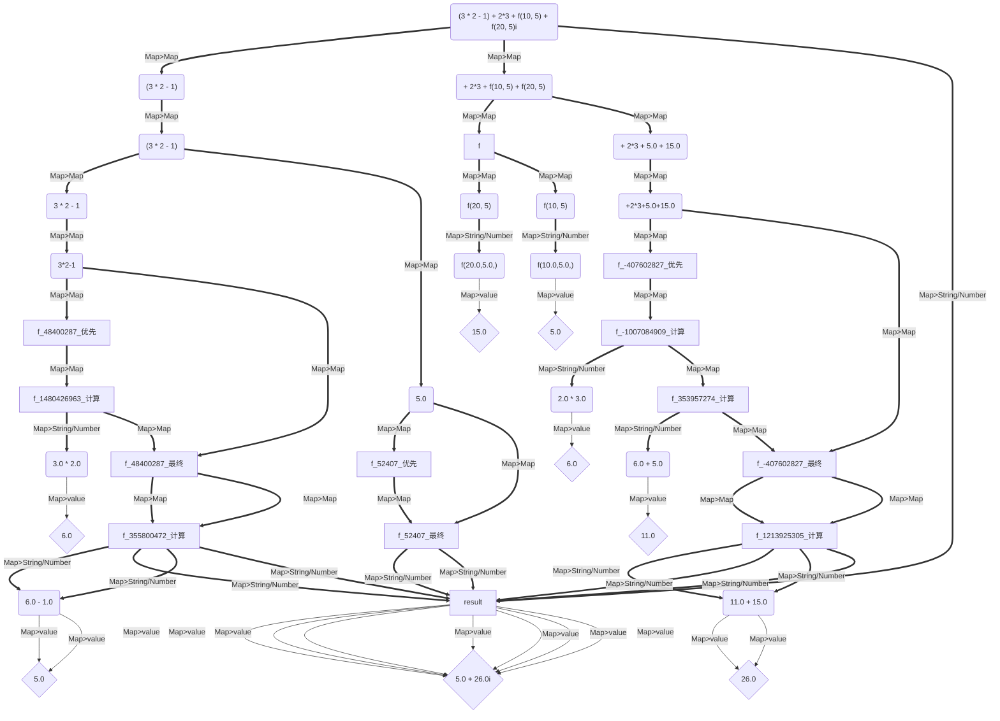

# 1.4.4 -> 1.4.5 版本更新日志

### 更新时间：2024年06月22日

==Java==

- 更新版本号为 1.4.5
- 新增了复数表达式对象 以及 复数计算组件。

```java
import io.github.beardedManZhao.algorithmStar.operands.ComplexNumber;
import io.github.beardedManZhao.mathematicalExpression.core.Mathematical_Expression;
import io.github.beardedManZhao.mathematicalExpression.core.calculation.function.Functions;
import io.github.beardedManZhao.mathematicalExpression.core.calculation.number.ComplexCalculation;
import io.github.beardedManZhao.mathematicalExpression.core.container.CalculationComplexResults;
import io.github.beardedManZhao.mathematicalExpression.core.container.ComplexExpression;
import io.github.beardedManZhao.mathematicalExpression.core.container.FunctionExpression;
import io.github.beardedManZhao.mathematicalExpression.exceptional.WrongFormat;

@Functions({
        "f(x, y) = x - y"
})
public class MAIN {
    public static void main(String[] args) throws WrongFormat {
        Mathematical_Expression.register_function(MAIN.class);
        // 将一个复数编译为计算表达式对象
        final ComplexCalculation instance = (ComplexCalculation) Mathematical_Expression.getInstance(Mathematical_Expression.complexCalculation);
        final String s = "3 * 2 - 1 + 2*3 + f(10, 5)";
        instance.check(s);
        final ComplexExpression compile = instance.compile(s, true);

        // 我们还可以直接获取到复数的实部 和 虚部的表达式对象！
        final FunctionExpression real = compile.getFunctionExpression1();
        final FunctionExpression imaginary = compile.getFunctionExpression2();
        System.out.println(real.getExpressionStr());
        System.out.println(imaginary.getExpressionStr());

        // 直接计算出复数的结果
        final CalculationComplexResults calculation = compile.calculationCache(false);
        // 查看结果
        System.out.println(compile);
        System.out.println(calculation);
        // 获取到复数对象
        final ComplexNumber complexNumber = calculation.toComplexNumber();
        // 直接 使用科学计算库 参与共轭计算
        final ComplexNumber conjugate = complexNumber.conjugate();
        System.out.println(conjugate);
        // 还可以参与加法等运算 在这里是 自己 + 自己
        final ComplexNumber add = complexNumber.add(conjugate);
        System.out.println(add);

    }
}
```

- 为复数计算组件增加了 `explain` 支持！

```java
import io.github.beardedManZhao.mathematicalExpression.core.Mathematical_Expression;
import io.github.beardedManZhao.mathematicalExpression.core.calculation.function.Functions;
import io.github.beardedManZhao.mathematicalExpression.core.calculation.number.ComplexCalculation;
import io.github.beardedManZhao.mathematicalExpression.core.container.LogResults;
import io.github.beardedManZhao.mathematicalExpression.exceptional.WrongFormat;
import top.lingyuzhao.varFormatter.core.VarFormatter;

@Functions({
        "f(x, y) = x - y"
})
public class MAIN {
    public static void main(String[] args) throws WrongFormat {
        Mathematical_Expression.register_function(MAIN.class);
        // 将一个复数编译为计算表达式对象
        final ComplexCalculation instance = (ComplexCalculation) Mathematical_Expression.getInstance(Mathematical_Expression.complexCalculation);
        final String s = "(3 * 2 - 1) + 2*3 + f(10, 5) + f(20, 5)i";
        final LogResults explain = instance.explain(s, true);
        System.out.println(explain.explain(VarFormatter.MERMAID));
    }
}
```

