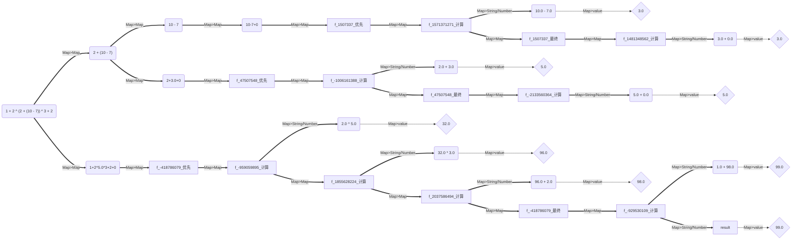

# 1.4.5 -> 1.4.6 版本更新日志

### 更新时间：2024年07月15日

==Java==

- 更新版本号为 1.4.6
- 对于 explain 功能进行了优化处理，1.4.6 中的 explain 具有更优秀的展示效果，相较于1.4.5 版本，1.4.6 版本的 explain
  更加美观，它移除了冗余的信息，并且将一些信息进行了整合，更加简洁明了。

```java
import io.github.beardedManZhao.mathematicalExpression.core.Mathematical_Expression;
import io.github.beardedManZhao.mathematicalExpression.core.calculation.Calculation;
import io.github.beardedManZhao.mathematicalExpression.core.container.LogResults;
import io.github.beardedManZhao.mathematicalExpression.exceptional.WrongFormat;
import top.lingyuzhao.varFormatter.core.VarFormatter;

public class MAIN {
    public static void main(String[] args) throws WrongFormat {
        // 获取到一个有括号计算组件 您可以根据需求更换组件
        final Calculation instance = Mathematical_Expression.getInstance(Mathematical_Expression.bracketsCalculation2);
        // 然后进行一个简单的检查 这里我们要查询 1 + 2 ^ 4 - 2 * 3 + 2 的执行过程
        final String s = "1 + 2 ^ (2 + (10 - 7)) * 3 + 2";
        instance.check(s);
        // 我们可以通过 explain 获取到执行过程 它会返回一个对象 这个对象中有一个 result 字段 这个字段就是计算出来的结果
        final LogResults explain = instance.explain(s, true);
        System.out.println("计算结果：" + explain.getResult());
        // 事实上 LogResults 更大的作用是进行执行过程可视化 下面就是一个例子
        // 设置输出图的时候不拼接名字，因为在这里有很多的变量 需要进行关联的！拼接名字就不好关联了
        explain.setNameJoin(false);
        // 通过我们引入的 VarFormatter 可以很方便地进行格式化 我们在这里格式化为 MERMAID 图 代码
        System.out.println("graph LR");
        System.out.println(VarFormatter.MERMAID.getFormatter(true).format(explain));
    }
}
```

这里是旧版本可视化的效果，可以看到其中的连接非常繁杂。

```mermaid
graph LR
    f_-1523352178("1 + 2 ^ (2 + (10 - 7)) * 3 + 2")
    f_-1523352178 == Map>Map ==> f_1563255009
    f_1563255009("2 + (10 - 7)")
    f_1563255009 == Map>Map ==> f_1448155011
    f_1448155011("10 - 7")
    f_1448155011 == Map>Map ==> f_1507337
    f_1507337("10-7+0")
    f_1507337 == Map>Map ==> f_1507337_优先
    f_1507337_优先 == Map>Map ==> f_1571371271_计算
    f_1571371271("10.0 - 7.0")
    f_1571371271_计算 == Map>String/Number ==> f_1571371271
    f_1571371271 -- Map>value --> f_1571371271v{"3.0"}
    f_1571371271_计算 == Map>Map ==> f_1507337_最终
    f_1507337_最终 == Map>Map ==> f_1481348562_计算
    f_1481348562("3.0 + 0.0")
    f_1481348562_计算 == Map>String/Number ==> f_1481348562
    f_1481348562 -- Map>value --> f_1481348562v{"3.0"}
    f_1481348562_计算 == Map>String/Number ==> result
    result -- Map>value --> resultv{"3.0"}
    f_1507337 == Map>Map ==> f_1507337_最终
    f_1507337_最终 == Map>Map ==> f_1481348562_计算
    f_1481348562("3.0 + 0.0")
    f_1481348562_计算 == Map>String/Number ==> f_1481348562
    f_1481348562 -- Map>value --> f_1481348562v{"3.0"}
    f_1481348562_计算 == Map>String/Number ==> result
    result -- Map>value --> resultv{"3.0"}
    f_1563255009 == Map>Map ==> f_47507548
    f_47507548("2+3.0+0")
    f_47507548 == Map>Map ==> f_47507548_优先
    f_47507548_优先 == Map>Map ==> f_-1006161388_计算
    f_-1006161388("2.0 + 3.0")
    f_-1006161388_计算 == Map>String/Number ==> f_-1006161388
    f_-1006161388 -- Map>value --> f_-1006161388v{"5.0"}
    f_-1006161388_计算 == Map>Map ==> f_47507548_最终
    f_47507548_最终 == Map>Map ==> f_-2133560364_计算
    f_-2133560364("5.0 + 0.0")
    f_-2133560364_计算 == Map>String/Number ==> f_-2133560364
    f_-2133560364 -- Map>value --> f_-2133560364v{"5.0"}
    f_-2133560364_计算 == Map>String/Number ==> result
    result -- Map>value --> resultv{"5.0"}
    f_47507548 == Map>Map ==> f_47507548_最终
    f_47507548_最终 == Map>Map ==> f_-2133560364_计算
    f_-2133560364("5.0 + 0.0")
    f_-2133560364_计算 == Map>String/Number ==> f_-2133560364
    f_-2133560364 -- Map>value --> f_-2133560364v{"5.0"}
    f_-2133560364_计算 == Map>String/Number ==> result
    result -- Map>value --> resultv{"5.0"}
    f_-1523352178 == Map>Map ==> f_-418786079
    f_-418786079("1+2^5.0*3+2+0")
    f_-418786079 == Map>Map ==> f_-418786079_优先
    f_-418786079_优先 == Map>Map ==> f_-959059895_计算
    f_-959059895("2.0 ^ 5.0")
    f_-959059895_计算 == Map>String/Number ==> f_-959059895
    f_-959059895 -- Map>value --> f_-959059895v{"32.0"}
    f_-959059895_计算 == Map>Map ==> f_1855628224_计算
    f_1855628224("32.0 * 3.0")
    f_1855628224_计算 == Map>String/Number ==> f_1855628224
    f_1855628224 -- Map>value --> f_1855628224v{"96.0"}
    f_1855628224_计算 == Map>Map ==> f_2037586494_计算
    f_2037586494("96.0 + 2.0")
    f_2037586494_计算 == Map>String/Number ==> f_2037586494
    f_2037586494 -- Map>value --> f_2037586494v{"98.0"}
    f_2037586494_计算 == Map>Map ==> f_-418786079_最终
    f_-418786079_最终 == Map>Map ==> f_-929530109_计算
    f_-929530109("1.0 + 98.0")
    f_-929530109_计算 == Map>String/Number ==> f_-929530109
    f_-929530109 -- Map>value --> f_-929530109v{"99.0"}
    f_-929530109_计算 == Map>String/Number ==> result
    result -- Map>value --> resultv{"99.0"}
    f_-418786079 == Map>Map ==> f_-418786079_最终
    f_-418786079_最终 == Map>Map ==> f_-929530109_计算
    f_-929530109("1.0 + 98.0")
    f_-929530109_计算 == Map>String/Number ==> f_-929530109
    f_-929530109 -- Map>value --> f_-929530109v{"99.0"}
    f_-929530109_计算 == Map>String/Number ==> result
    result -- Map>value --> resultv{"99.0"}
```



下面是新版本对于可视化操进行优化之后的效果

