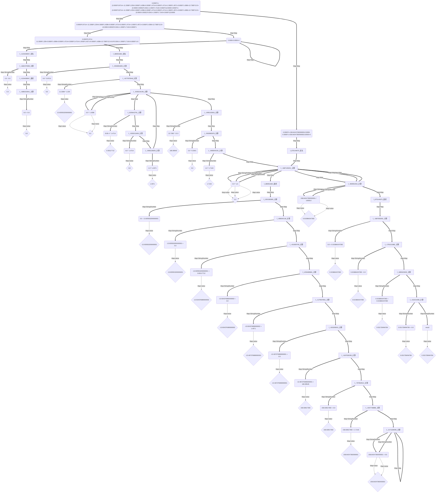

# 1.4.9 -> 1.5.0 版本更新日志

### 更新时间：2025年03月27日

==Java==

- 更新版本号为 1.5.0
- 重构 底层计算逻辑
    - 针对 长运算操作解析时的错误情况问题 进行了解决（来自小伙伴的提出，感谢他！）
    - 针对 计算操作 的时间复杂度 进行了降低，计算一个编译好的表达式的时间复杂度 在无括号表达式层降低为原来的一半！
        - 因为所有的表达式组件都是依赖 无括号表达式层进行计算，因此整体性能上升！

```java
import io.github.beardedManZhao.mathematicalExpression.core.Mathematical_Expression;
import io.github.beardedManZhao.mathematicalExpression.core.calculation.number.BracketsCalculation2;
import io.github.beardedManZhao.mathematicalExpression.core.container.PackExpression;

public class MAIN {

    public static void main(String[] args) {
        // +0.0000*1
        String formula = "0.0000*1+(0.0000*0.9714+-11.3308*1.229+0.0000*1.4286+0.0008*1.4714+0.0000*1.4714+1.0000*1.4571+0.0000*1.4286+12.7365*13.3+(0.0000-0.0000)*0.0341+1.0000*1.7143+0.0000*1)/10000-0.0000*1+(0.0000*0.9714+-11.3308*1.229+0.0000*1.4286+0.0008*1.4714+0.0000*1.4714+1.0000*1.4571+0.0000*1.4286+12.7365*13.3+(0.0000-0.0000)*0.0341+1.0000*1.7143+0.0000*1)/10000";
        final BracketsCalculation2 instance = (BracketsCalculation2) Mathematical_Expression.getInstance(
                // Select the different computing components you want to use here
                Mathematical_Expression.bracketsCalculation2
        );
        Mathematical_Expression.Options.setUseBigDecimal(false);
        PackExpression packExpression = instance.compileBigDecimal(formula, true);
        System.out.println(packExpression.getExpressionStr());
        System.out.println(packExpression.calculationBigDecimalsCache(false));
    }
}
```

```java
import io.github.beardedManZhao.mathematicalExpression.core.Mathematical_Expression;
import io.github.beardedManZhao.mathematicalExpression.core.calculation.number.BracketsCalculation2;
import io.github.beardedManZhao.mathematicalExpression.core.container.LogResults;
import top.lingyuzhao.varFormatter.core.VarFormatter;

public class MAIN {

    public static void main(String[] args) {
        // +0.0000*1
        String formula = "0.0000*1+(0.0000*0.9714+-11.3308*1.229+0.0000*1.4286+0.0008*1.4714+0.0000*1.4714+1.0000*1.4571+0.0000*1.4286+12.7365*13.3+(0.0000-0.0000)*0.0341+1.0000*1.7143+0.0000*1)/10000-0.0000*1+(0.0000*0.9714+-11.3308*1.229+0.0000*1.4286+0.0008*1.4714+0.0000*1.4714+1.0000*1.4571+0.0000*1.4286+12.7365*13.3+(0.0000-0.0000)*0.0341+1.0000*1.7143+0.0000*1)/10000";
        final BracketsCalculation2 instance = (BracketsCalculation2) Mathematical_Expression.getInstance(
                // Select the different computing components you want to use here
                Mathematical_Expression.bracketsCalculation2
        );
        LogResults explain = instance.explain(formula, true);
        explain.setNameJoin(false);
        String format = VarFormatter.MERMAID.getFormatter(true).format(explain);
        System.out.println(format);
    }
}
```

## 计算图

